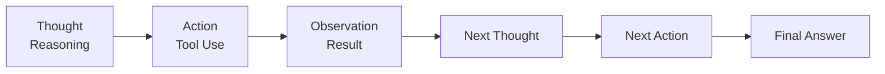

# ReAct Agent Implementation

## Overview

ReAct (Reasoning + Acting) is a prompting technique where the AI explicitly shows its reasoning process, takes actions, observes results, and iterates until reaching a final answer.

## ReAct Cycle



## Response Format

The agent MUST respond in this format:

```
Thought: <reasoning about what to do next>
Action: <tool_name> (only if using a tool)
Action Input: <input to the tool> (only if Action specified)
Observation: <result of action> (provided after tool execution)

Thought: I now have the answer
Final Answer: <complete answer>
```

## Example

```
Thought: I need to find out what files exist in the current directory.
Action: run_command
Action Input: ls -la
Observation: total 32 drwxr-xr-x 5 user staff 160 Mar 13 10:00 .

Thought: Now I have the directory listing. Let me count the items.
Action: count_items
Action Input: 5
Observation: There are 5 items.

Thought: I now have the answer
Final Answer: There are 5 items in the current directory.
```

## Key Components

### ReactTrace

```zig
const ReactTrace = struct {
    allocator: std.mem.Allocator,
    steps: std.ArrayList(ReactStep),
    
    pub fn init(allocator: std.mem.Allocator) Self
    pub fn deinit(self: *Self) void
    pub fn addStep(self: *Self, thought, action, action_input, observation, is_final) !void
    pub fn printTrace(self: *Self) void
    pub fn getSystemPrompt(allocator: std.mem.Allocator) ![]const u8
    pub fn isFinalAnswer(content: []const u8) bool
    pub fn parseSteps(self: *Self, content: []const u8) !void
};
```

### ReactStep

```zig
pub const ReactStep = struct {
    thought: []const u8,
    action: ?[]const u8,
    action_input: ?[]const u8,
    observation: ?[]const u8,
    is_final: bool,
};
```

## Integration

To use ReAct in an agent:

1. Import the ReAct module:
```zig
const react = @import("react.zig");
```

2. Get the system prompt:
```zig
const prompt = try react.ReactTrace.getSystemPrompt(allocator);
defer allocator.free(prompt);
```

3. Parse LLM responses:
```zig
var trace = react.ReactTrace.init(allocator);
defer trace.deinit();

try trace.parseSteps(llm_response_content);
trace.printTrace();
```

## Benefits

- **Transparent reasoning**: Users can see the agent's thought process
- **Debuggable**: Easy to trace where reasoning went wrong
- **Structured**: Clear separation of thought, action, and observation
- **Iterative**: Builds on previous observations

## Use Cases

- Complex problem solving requiring multiple steps
- Tool-heavy workflows where understanding agent decisions is important
- Debugging and monitoring agent behavior
- Educational applications where showing work is important

## Files

| File | Description |
|------|-------------|
| `libs/agent/src/agent/react.zig` | ReAct implementation |
| `docs/REACT.md` | This documentation |

## Testing

Run ReAct tests:
```bash
zig test libs/agent/src/agent/react.zig
```

Test coverage:
- `ReactTrace: init and deinit` - Basic initialization
- `ReactTrace: addStep` - Adding reasoning steps
- `ReactTrace: isFinalAnswer` - Detecting final answers
- `ReactTrace: parseSteps - simple` - Parsing ReAct format
