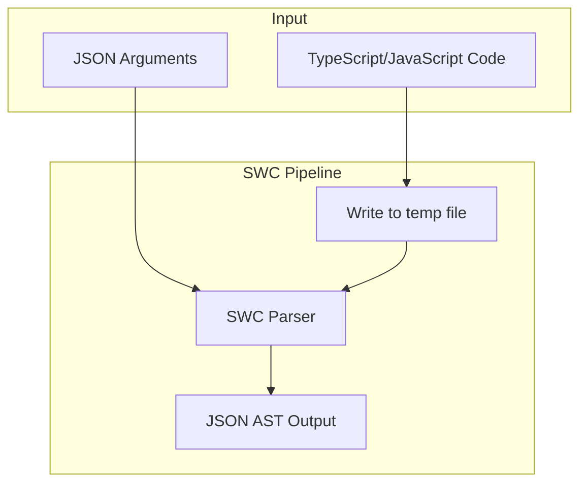
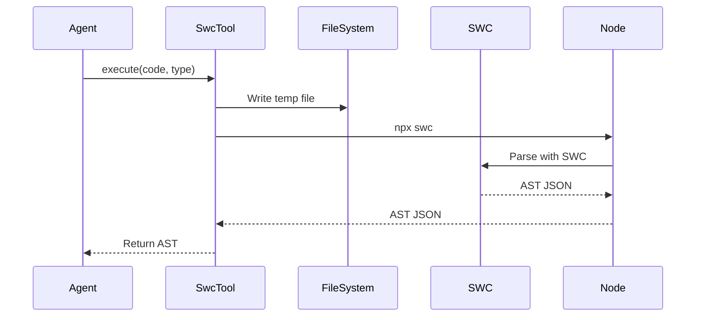
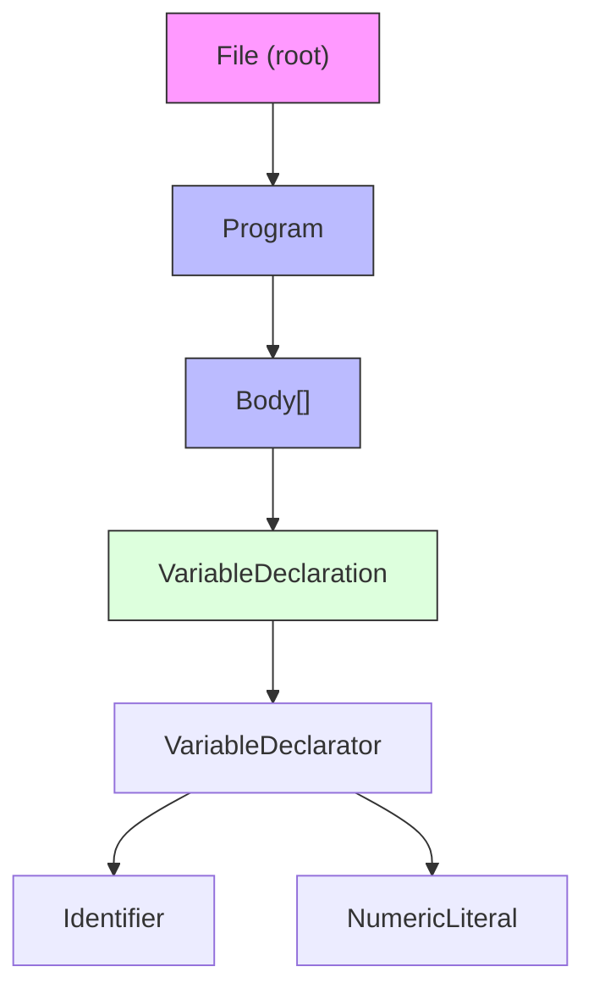
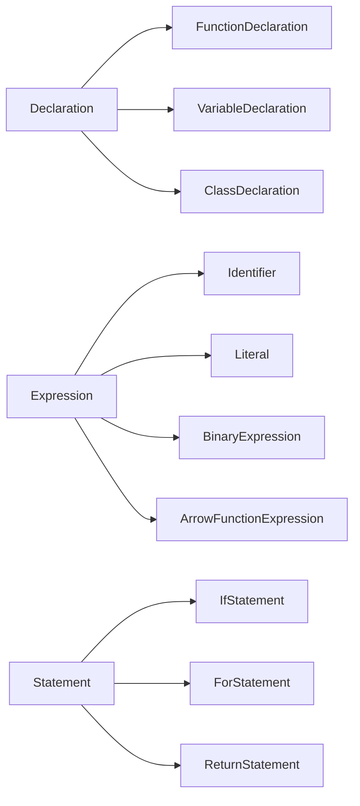
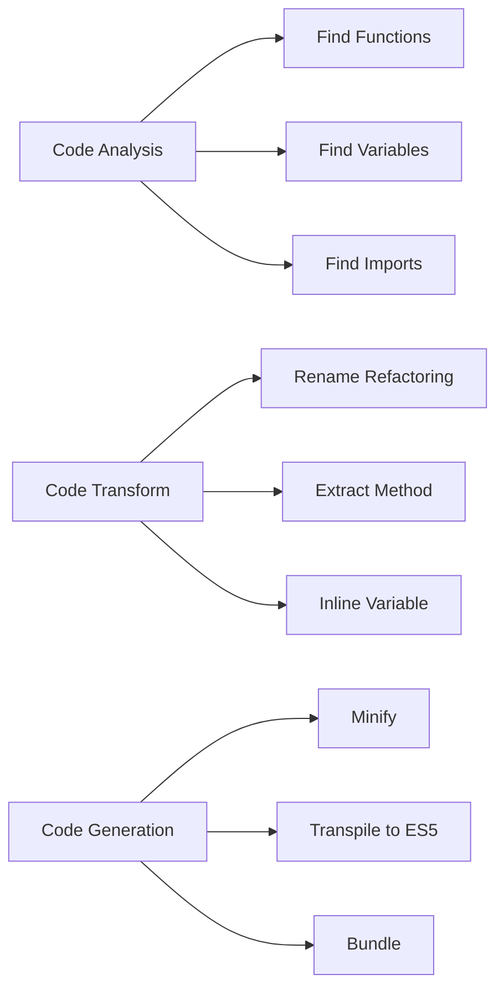

# SWC Parser Tool

SWC (Speedy Web Compiler) is a super-fast TypeScript/JavaScript compiler written in Rust. It can be used to parse JS/TS code into an Abstract Syntax Tree (AST).

## Architecture



## SWC Tool Flow



## AST Structure



## Example Usage

### TypeScript

```
Thought: I need to analyze the TypeScript code structure.
Action: parse_typescript
Action Input: {"code": "function add(a: number, b: number): number { return a + b; }", "type": "ts"}
Observation: {"type":"File","span":{"start":0,"end":51,"ctxt":0},"body":[{"type":"FunctionDeclaration"...}
```

### JavaScript

```
Thought: I need to analyze the JavaScript code structure.
Action: parse_typescript
Action Input: {"code": "const x = (a, b) => a + b;", "type": "js"}
Observation: {"type":"File","span":{"start":0,"end":26,"ctxt":0},"body":[{"type":"VariableDeclaration"...}
```

## AST Node Types



## Use Cases



- **Code Analysis**: Understand code structure
- **Refactoring**: Find all function calls, variables
- **Linting**: Analyze code patterns
- **Code Generation**: Transform AST to modify code
- **Documentation**: Extract function signatures

## Files

| File | Description |
|------|-------------|
| `libs/agent/src/agent/swc.zig` | SWC tool implementation |
| `.agents/skills/swc-parser/SKILL.md` | This documentation |

## Integration

The SWC tool is available in the agent's tool registry:

```zig
const swc = @import("swc.zig");
const tool = swc.SwcTool{};
try registry.register(.{
    .name = tool.name,
    .description = tool.description,
    .parameters = tool.parameters,
    .execute = tool.execute,
});
```

## Benefits

- **Fast**: Written in Rust, 20-70x faster than Babel
- **Accurate**: Produces correct ESTree-compatible AST
- **TypeScript**: Native TypeScript support
- **Transforms**: Can also minify, transpile, and transform code

## Testing

```bash
zig test libs/agent/src/agent/swc.zig
```

Tests:
- `SwcTool: tool metadata` - Verify tool name, description
- `SwcTool: parseAstNode with valid JSON` - Parse valid AST
- `SwcTool: parseAstNode with invalid JSON` - Handle errors
- `SwcTool: parseAstNode with missing type` - Handle missing fields
