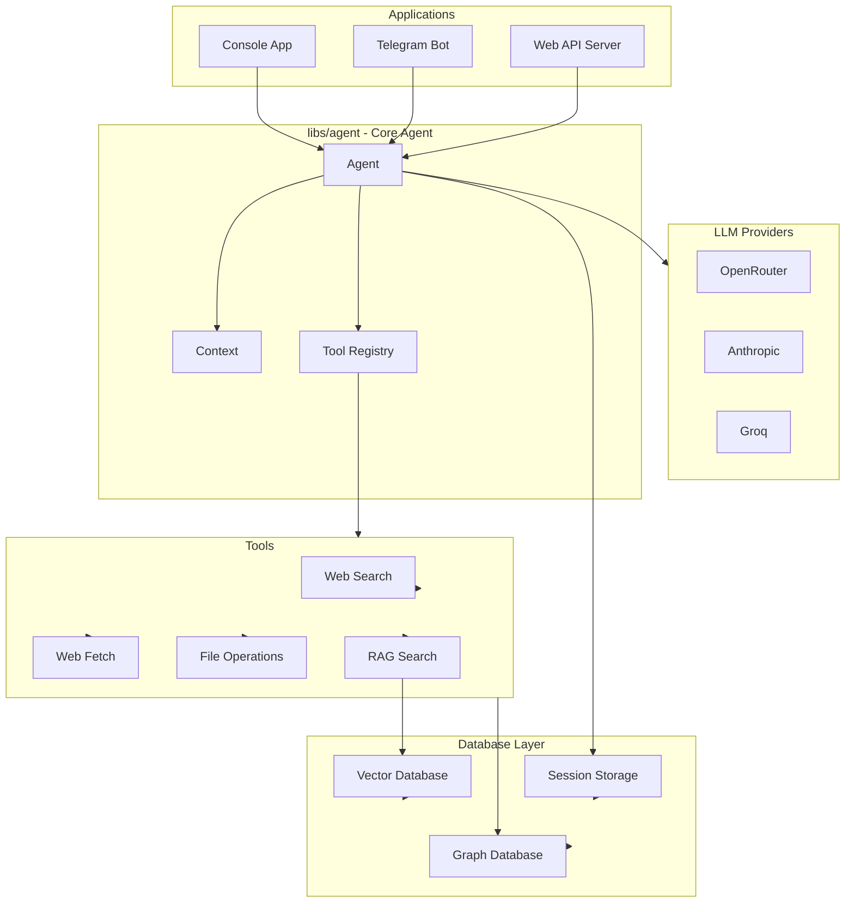
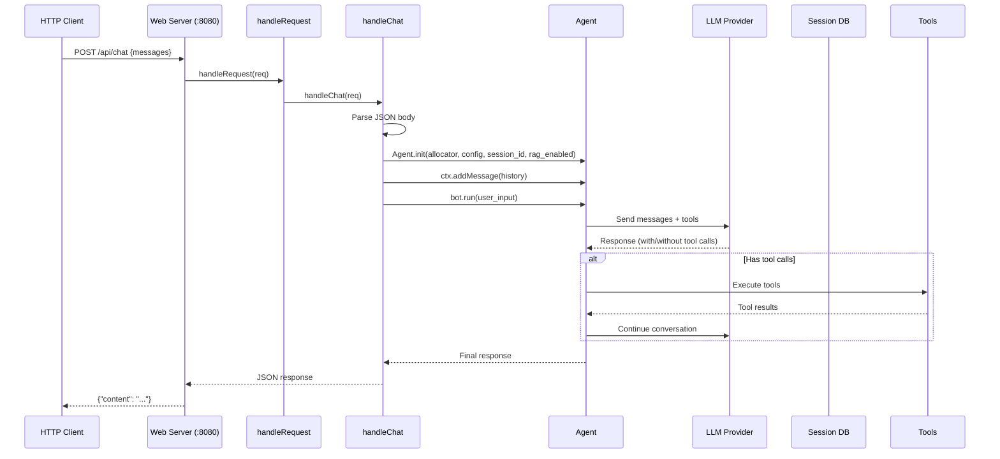
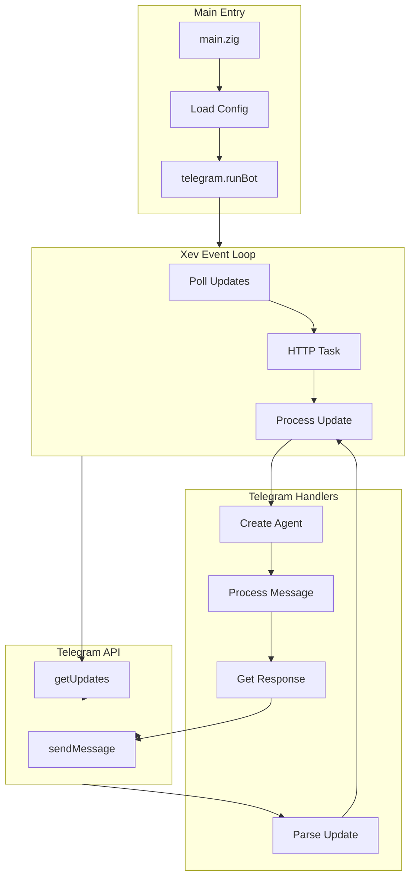
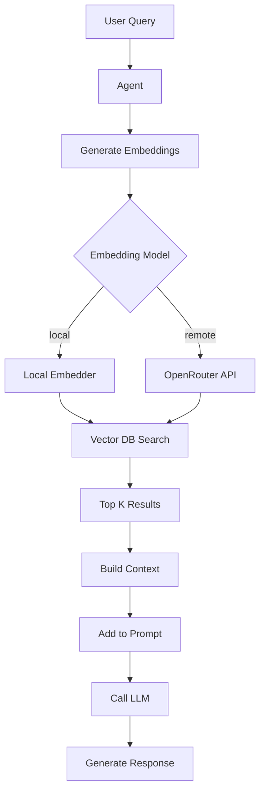
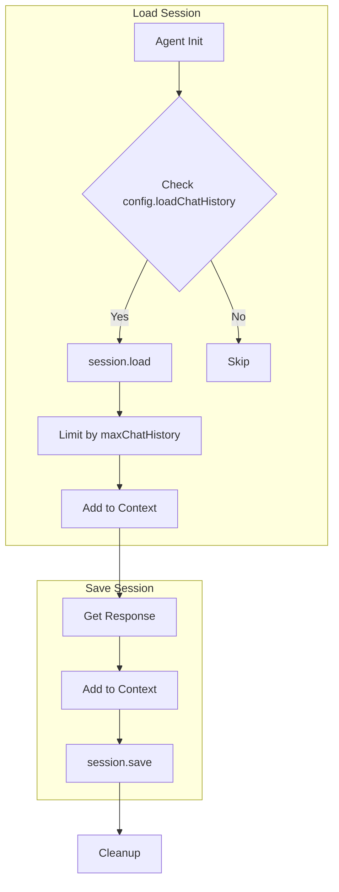
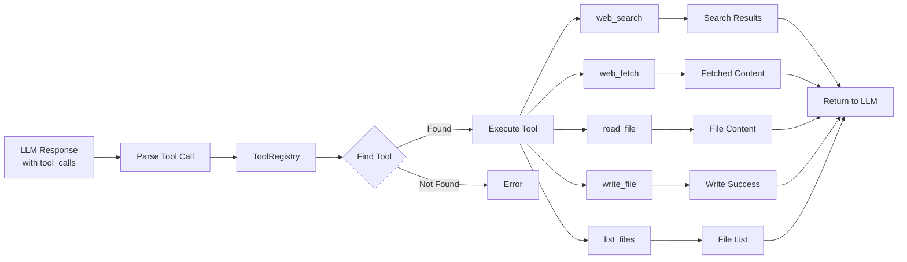
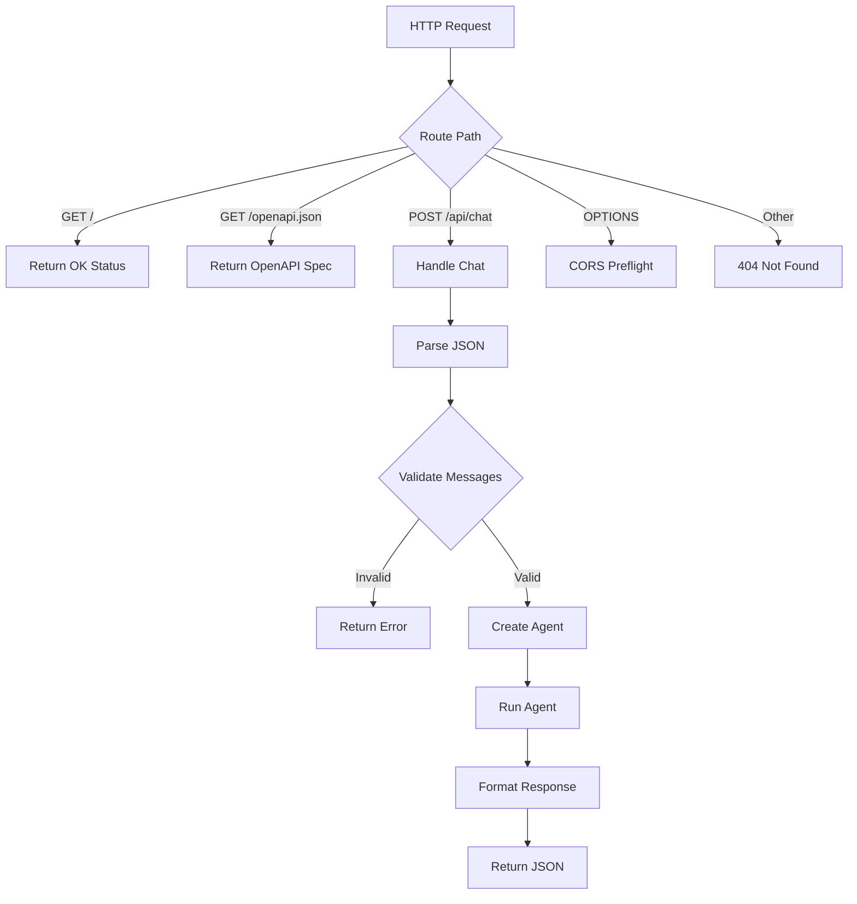
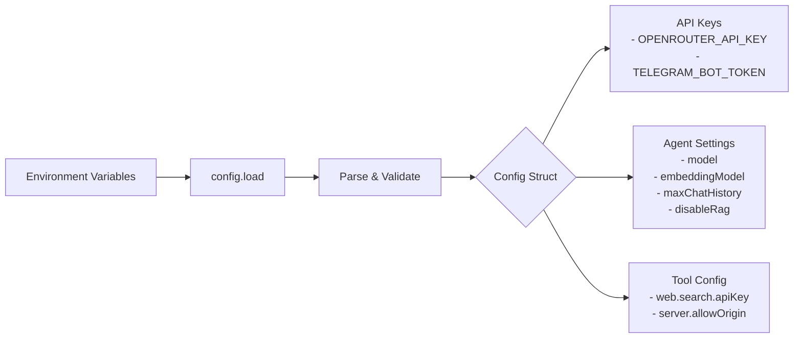

# Skill: SatiBot App Logic Flow Diagrams

This skill provides Mermaid diagrams illustrating the application logic and data flow in SatiBot.

## High-Level Architecture



## Web API Request Flow



## Telegram Bot Flow



## Agent Execution Flow

```mermaid
flowchart TB
    Start[User Input] --> Init[Initialize Agent]
    Init --> LoadHistory[Load Session History]
    LoadHistory --> SystemPrompt[Ensure System Prompt]
    SystemPrompt --> AddUser[Add User Message]
    AddUser --> Loop{Loop (max 10)}
    
    Loop -->|Iteration| LLM[Call LLM Provider]
    LLM --> Response{Response Type}

    Response -->|Text| Save[Save to Context]
    Response -->|Tool Calls| Execute[Execute Tools]
    Execute --> Results[Get Results]
    Results --> LLM
    
    Save --> Done{More iterations?}
    Done -->|Yes| Loop
    Done -->|No| Return[Return Response]
    
    Return --> GetMsgs[ctx.getMessages]
    GetMsgs --> LastMsg[Last Assistant Message]
```

## Console App Flow

```mermaid
flowchart LR
    Start[main] --> Args[Parse Args --no-rag]
    Args --> Config[Load Config]
    Config --> Run[console_sync.run]
    Run --> Loop{Chat Loop}
    
    Loop --> Input[Read Input]
    Input --> Empty{Empty?}
    Empty -->|Yes| Exit
    Empty -->|No| Agent[Create Agent]
    
    Agent --> RunBot[bot.run(input)]
    RunBot --> Output[Print Response]
    Output --> Loop
```

## RAG (Retrieval-Augmented Generation) Flow



## Session Management Flow



## Tool Execution Flow



## Web Server Endpoints



## Key Files Reference

| Component | Key Files |
|-----------|-----------|
| Agent | `libs/agent/src/agent.zig` |
| Context | `libs/agent/src/agent/context.zig` |
| Tools | `libs/agent/src/agent/tools.zig` |
| Web Server | `apps/web/src/main.zig` |
| Telegram Bot | `apps/telegram/src/telegram/telegram.zig` |
| Console | `apps/console/src/main.zig` |
| Config | `libs/core/src/config.zig` |

## Configuration Flow


