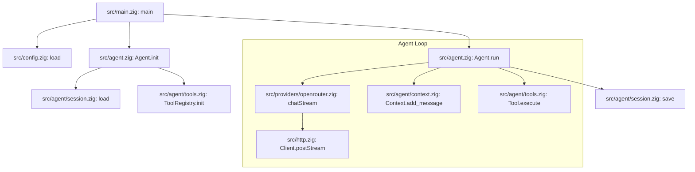

<p align="center">
  
</p>

# minbot

Inspired by [OpenClawd](https://github.com/openclaw/openclaw) and [nanobot](https://github.com/HKUDS/nanobot), `minbot` is a Ziglang-based agent framework for:

- Chat tools intergation: Telegram, Discord, WhatsApp, etc.
- LLM providers (OpenRouter, Anthropic, etc.)
- Tool execution: shell commands, HTTP requests, etc.
- Conversation history
- Session persistence: Full session persistence in `~/.bots/sessions/`.
- Easy to add SKILL from any source, the agent can browse, search, and install its own skills.
  - Browse skills: <https://agent-skills.md/>
  - Install: `./scripts/install-skill.sh <github-url-or-path>`
- Context management: use memory, file, etc.

## Usage

```bash
# Run the agent with a message
zig build run -- agent -m "Your message"

# Run with a specific session ID to persist history
zig build run -- agent -m "Follow-up message" -s my-session
```

## Structure

- `src/main.zig`: CLI entry point
- `src/agent.zig`: Agent logic
- `src/config.zig`: Configuration
- `src/http.zig`: HTTP client
- `src/providers/base.zig`: Provider interface
- `src/providers/openrouter.zig`: OpenRouter provider
- `src/root.zig`: Library exports
- `src/agent/context.zig`: Conversation history management
- `src/agent/session.zig`: Session persistence
- `src/agent/tools.zig`: Tool system and registry

## Architecture

### Component Hierarchy (Text)

```text
src/main.zig (runAgent)
├── src/config.zig (Config.load)
├── src/agent.zig (Agent.init)
│   ├── src/agent/session.zig (load)
│   └── src/agent/tools.zig (ToolRegistry.init)
└── src/agent.zig (Agent.run)
    ├── src/providers/openrouter.zig (chatStream)
    │   └── src/http.zig (Client.postStream)
    ├── src/agent/context.zig (Context.add_message)
    ├── src/agent/tools.zig (Tool.execute)
    └── src/agent/session.zig (save)
```

#### ReAct Loop

```text
┌─────────────────────────────────────────────────────────────────┐
│                         Agent.run()                             │
└────────────────────────────┬────────────────────────────────────┘
                             │
                             ▼
              ┌──────────────────────────────┐
              │  Add user message to context │
              └──────────────┬───────────────┘
                             │
         ┌───────────────────┴───────────────────┐
         │           AGENT LOOP                  │
         │       (max 10 iterations)             │
         │                                       │
         │    ┌─────────────────────────────┐    │
         │    │   LLM chatStream() call     │◄───┼──────────┐
         │    │   (Selects Provider)        │    │          │
         │    └─────────────┬───────────────┘    │          │
         │                  │                    │          │
         │                  ▼                    │          │
         │    ┌─────────────────────────────┐    │          │
         │    │  Add assistant response     │    │          │
         │    │  to context                 │    │          │
         │    └─────────────┬───────────────┘    │          │
         │                  │                    │          │
         │                  ▼                    │          │
         │         ┌────────────────┐            │          │
         │         │  Tool calls?   │            │          │
         │         └───────┬────────┘            │          │
         │                 │                     │          │
         │        ┌────────┴────────┐            │          │
         │        │                 │            │          │
         │       YES               NO            │          │
         │        │                 │            │          │
         │        ▼                 │            │          │
         │  ┌───────────────┐       │            │          │
         │  │ Execute tools │       │            │          │
         │  └───────┬───────┘       │            │          │
         │          │               │            │          │
         │          ▼               │            │          │
         │  ┌───────────────┐       │            │          │
         │  │ Add tool      │       │            │          │
         │  │ results/errors│───────┼────────────┼──────────┘
         │  │ to context    │       │            │ (continue loop)
         │  └───────────────┘       │            │
         │                          │            │
         └──────────────────────────┼────────────┘
                                    │
                                    ▼ (break loop)
              ┌──────────────────────────────┐
              │     Save session to disk     │
              └──────────────────────────────┘
```

### System Flow (Mermaid)



## Configuration

The agent's configuration is stored in `~/.bots/config.json`. You can configure your providers and chat tools there:

```json
{
  "agents": {
    "defaults": {
      "model": "anthropic/claude-3-7-sonnet"
    }
  },
  "providers": {
    "openrouter": {
      "apiKey": "YOUR_OPENROUTER_KEY"
    },
    "anthropic": {
      "apiKey": "YOUR_ANTHROPIC_KEY"
    }
  },
  "tools": {
    "web": {
      "search": {
        "apiKey": "YOUR_BRAVE_SEARCH_KEY"
      }
    },
    "telegram": {
      "botToken": "YOUR_BOT_TOKEN",
      "chatId": "YOUR_DEFAULT_CHAT_ID"
    },
    "discord": {
      "webhookUrl": "YOUR_WEBHOOK_URL"
    },
    "whatsapp": {
      "accessToken": "YOUR_META_ACCESS_TOKEN",
      "phoneNumberId": "YOUR_PHONE_NUMBER_ID",
      "recipientPhoneNumber": "YOUR_DEFAULT_RECIPIENT"
    }
  }
}
```
