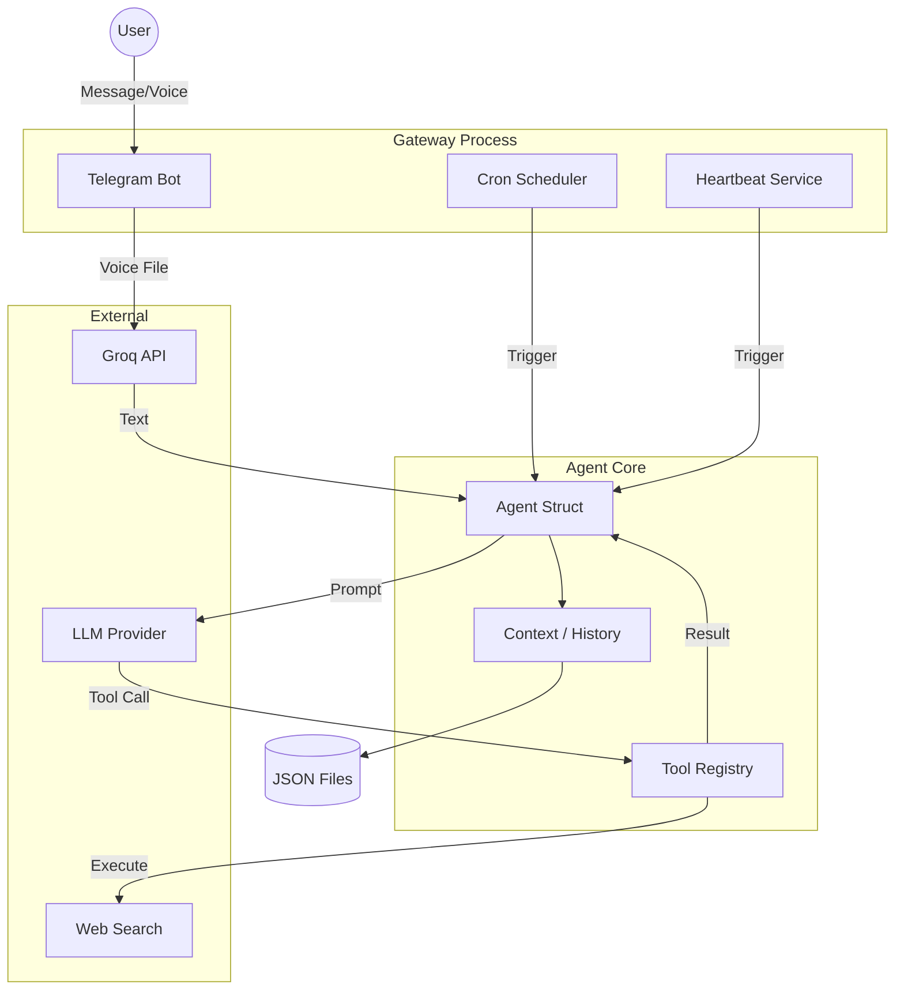

# SatiBot Architecture

SatiBot is built in **Zig** (version 0.15.2), focusing on performance, memory safety, and explicit controlflow. It uses a **ReAct** (Reason+Action) loop for agentic behavior.

## Core Components

### 1. `Agent` (`src/agent.zig`)

The central struct that manages:

- **Context**: Conversation history (messages, tool results).
- **ToolRegistry**: Available capabilities.
- **Provider**: Connection to the LLM (OpenRouter, etc.).

### 2. `Gateway` (`src/agent/gateway.zig`)

A multi-threaded supervisor that runs background services:

- **Telegram Thread**: Long-polling loop for fetching updates.
- **Cron Thread**: Ticks every second to check for scheduled jobs.
- **Heartbeat Thread**: Ticks periodically to process the heartbeat file.

#### `XevEventLoop` (`src/utils/xev_event_loop.zig`)

A high-performance asynchronous event loop based on **libxev**. It handles non-blocking I/O and task scheduling using platform-native APIs (io_uring, kqueue, epoll).

- **Task Handler**: Centralized processing for background tasks.
- **HTTP Integration**: HTTP requests are processed asynchronously as event loop tasks.
- **Offset Management**: Tracks the polling state for Telegram.

### 3. `ToolRegistry` (`src/agent/tools.zig`)

A dynamic dispatch system for tools. Tools are defined as Zig functions matching the signature:

```zig
fn(ctx: ToolContext, args: []const u8) ![]const u8
```

This allows tools to be statically compiled but dynamically invoked by the LLM's string output.

### 4. Memory & persistence

- **Session API**: JSON-based storage in `~/.bots/sessions/`.
- **VectorDB**: Simple cosine-similarity search for long-term memory retrieval.
- **GraphDB**: Node-Edge storage for mapping relationships (e.g., User -> likes -> Zig).

---

## The Agent Loop (ReAct)

The core loop in `Agent.run()` follows this pattern:

1. **Input**: Receive user message.
2. **Context**: Append message to chat history.
3. **Think**: Send history to LLM.
4. **Decide**:
    - **Text content?** -> Display/Send to user.
    - **Tool call?** ->
        1. Parse arguments (JSON).
        2. **Execute**: Look up tool in Registry and run it.
        3. **Observe**: Append tool result to context.
        4. **Loop**: Go back to Step 3 (Think) with new information.
    - **Done?** -> Break loop (or max iterations reached).
5. **Persist**: Save updated session state to disk.

---

## Component Diagram


