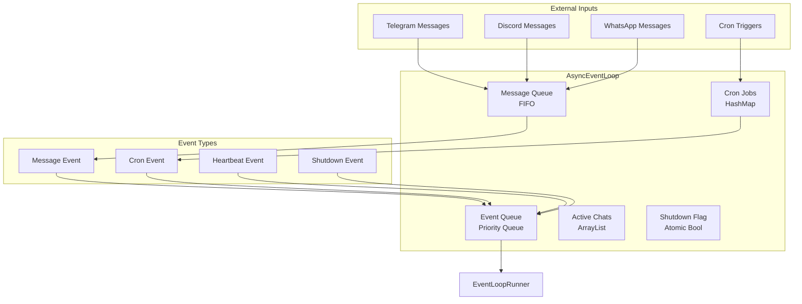
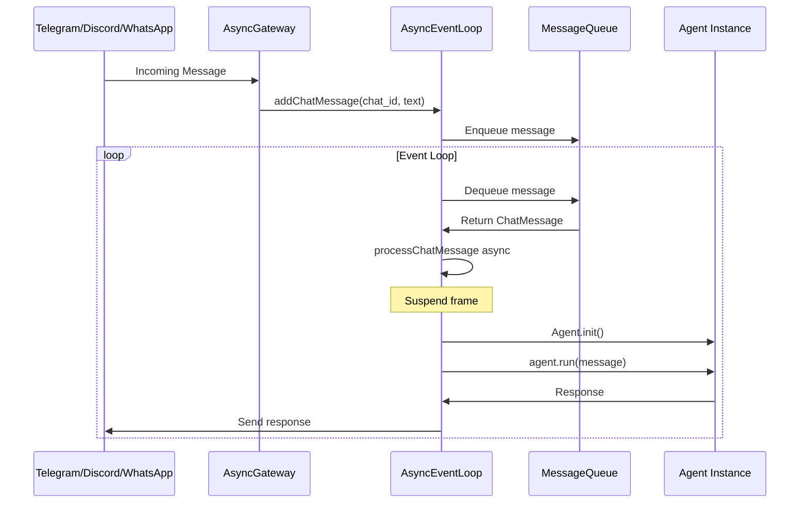
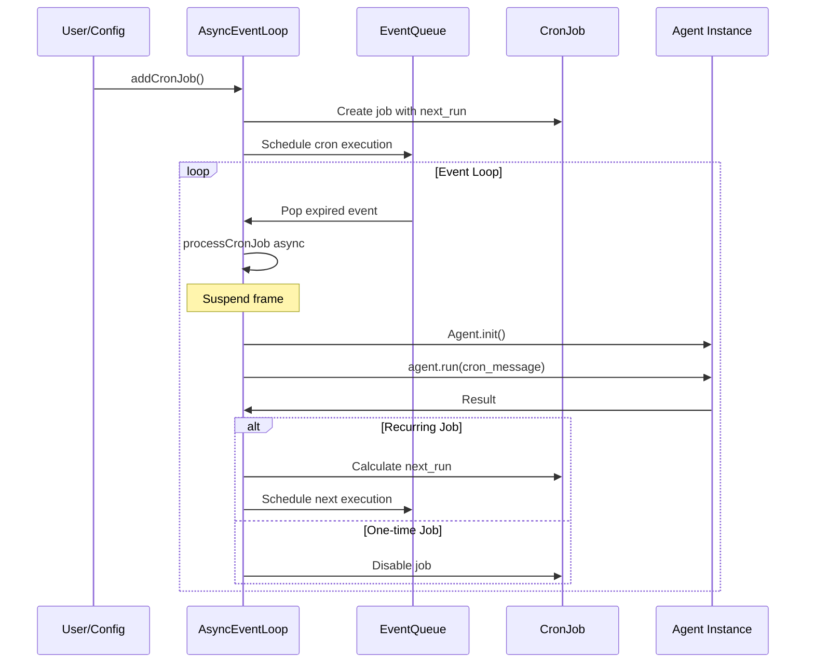
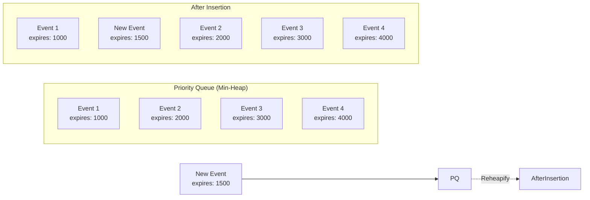
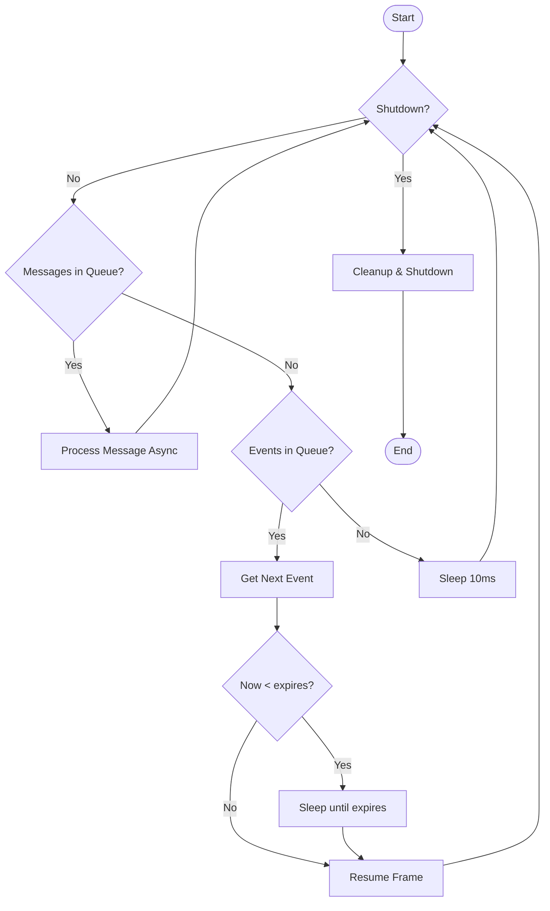
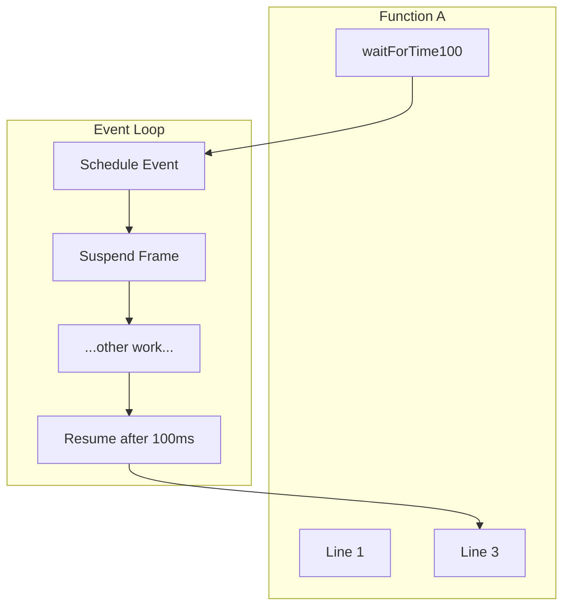
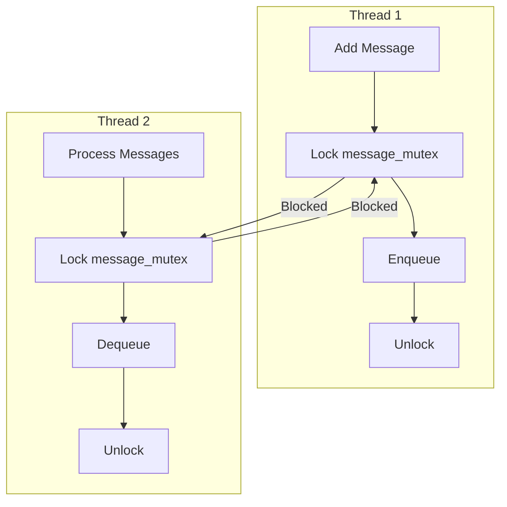
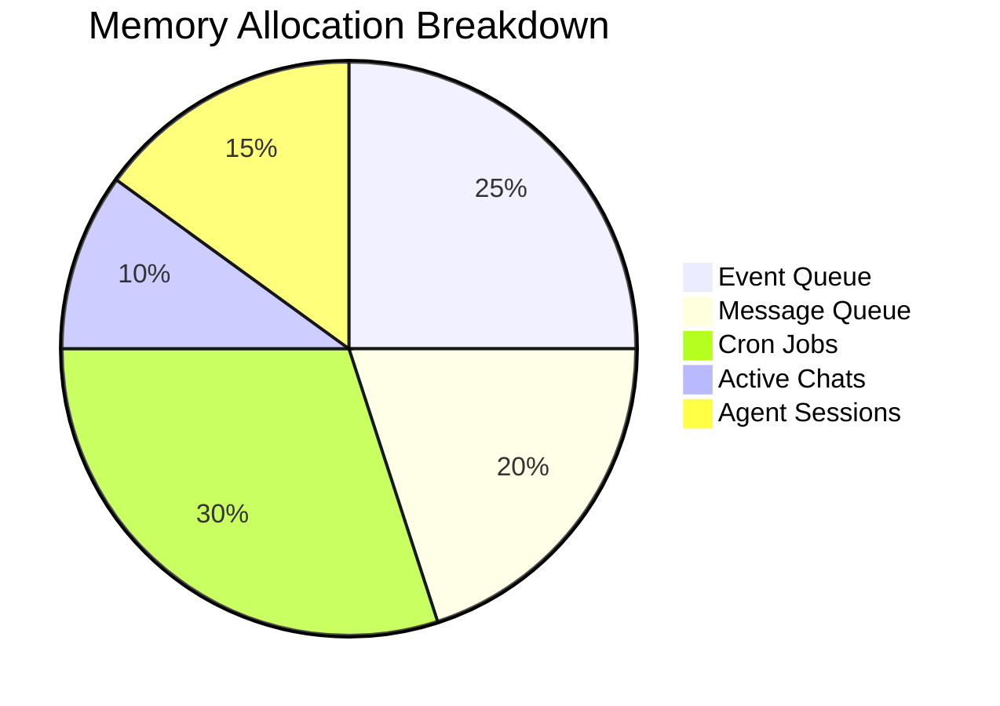
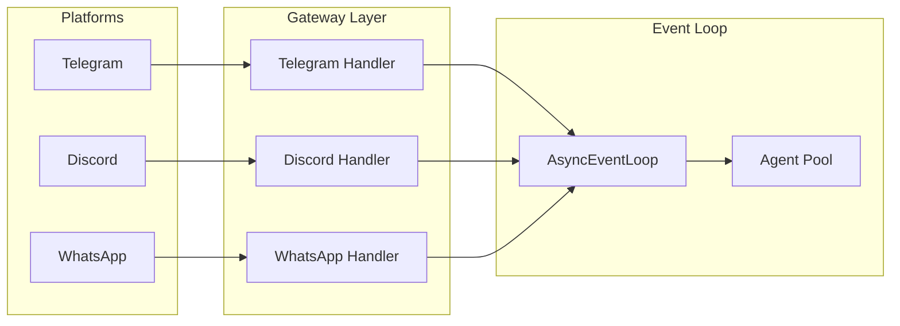
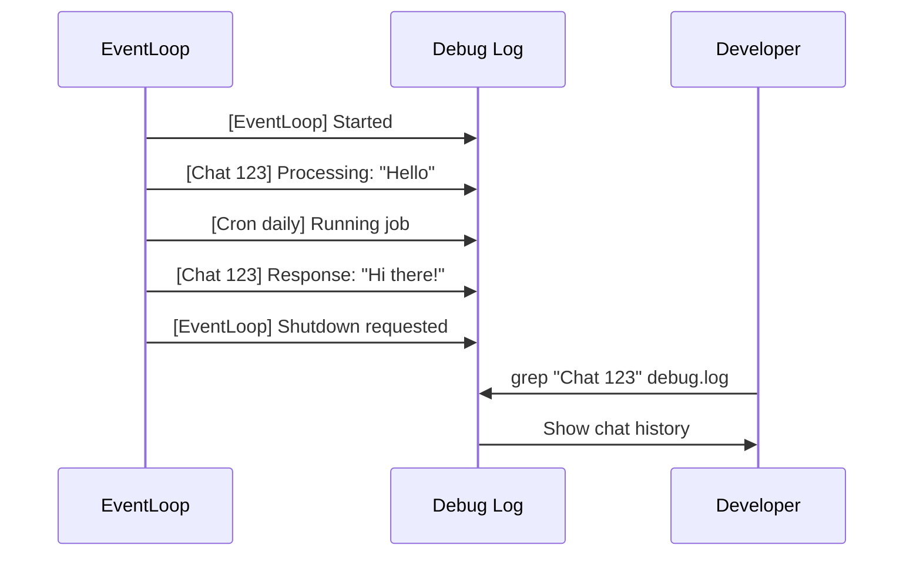

# Async Event Loop - Detailed Documentation

## Overview

The Async Event Loop is a high-performance, non-blocking event system designed to efficiently handle multiple concurrent operations in SatiBot. It uses Zig's async/await primitives with priority queues to manage timed events and message processing.

## Architecture

### Core Components



## Event Flow

### Message Processing Flow



### Cron Job Execution Flow



## Data Structures

### Event Structure

```zig
const Event = struct {
    type: EventType,        // Message, Cron, Heartbeat, Shutdown
    expires: u64,          // Execution timestamp (nanoseconds)
    frame: anyframe,       // Suspended execution frame
    chat_id: ?i64,         // Associated chat ID
    message: ?[]const u8,  // Message content
    cron_id: ?[]const u8,  // Cron job ID
};
```

### Priority Queue Operations



## Key Algorithms

### Event Loop Main Algorithm



### Async/Await Pattern



## Thread Safety

### Mutex Protection



### Atomic Operations

- **Shutdown Flag**: Uses `std.atomic.Value(bool)` for lock-free shutdown signaling
- **Active Chat Tracking**: Protected by mutex to prevent race conditions
- **Cron Job Updates**: Protected by mutex during modifications

## Performance Characteristics

### Time Complexity

| Operation | Complexity | Description |
|----------|------------|-------------|
| Add Event | O(log n) | Priority queue insertion |
| Pop Event | O(log n) | Priority queue removal |
| Add Message | O(1) | ArrayList append |
| Process Message | O(1) | ArrayList remove first |
| Cron Lookup | O(1) | HashMap lookup |

### Memory Usage



## Usage Examples

### Basic Setup

```zig
var event_loop = try AsyncEventLoop.init(allocator, config);
defer event_loop.deinit();

// Add a recurring cron job
try event_loop.addCronJob(
    "daily_report",
    "Daily Report",
    "Generate analytics",
    .{ .kind = .every, .every_ms = 24 * 60 * 60 * 1000 }
);

// Process messages
try event_loop.addChatMessage(123456, "Hello, bot!");

// Run the loop
try event_loop.run();
```

### Advanced Configuration

```zig
// Multiple cron jobs with different schedules
try event_loop.addCronJob(
    "hourly_health",
    "Health Check",
    "Check system status",
    .{ .kind = .every, .every_ms = 60 * 60 * 1000 }
);

try event_loop.addCronJob(
    "friday_report",
    "Weekly Report",
    "Generate Friday report",
    .{ 
        .kind = .at,
        .at_ms = calculateNextFriday()
    }
);

// Simulate high message load
for (0..1000) |i| {
    const chat_id = @as(i64, @intCast(i % 100));
    const message = try std.fmt.allocPrint(allocator, "Message {}", .{i});
    try event_loop.addChatMessage(chat_id, message);
}
```

## Integration Points

### Gateway Integration



### Provider Integration

The event loop is provider-agnostic and works with:

- **Anthropic**: Claude models
- **OpenRouter**: Multiple model access
- **Groq**: Fast inference & transcription
- **Custom Providers**: Extensible architecture

## Monitoring & Debugging

### Event Loop Metrics

```zig
// Track performance
const metrics = struct {
    var messages_processed: u64 = 0;
    var cron_jobs_run: u64 = 0;
    var avg_event_latency: u64 = 0;
    var queue_depth: u64 = 0;
};
```

### Debug Logging



## Best Practices

### 1. Error Handling

- Always handle errors in async functions
- Use `catch` blocks in void functions
- Log errors for debugging

### 2. Resource Management

- Free allocated strings promptly
- Use `defer` for cleanup
- Monitor queue depths

### 3. Performance Tips

- Batch similar operations
- Avoid long-running tasks in event loop
- Use separate threads for I/O-bound operations

### 4. Scaling Considerations

- Consider multiple event loop instances
- Implement load balancing
- Use persistent queues for reliability

## Troubleshooting

### Common Issues

1. **Memory Leaks**

   - Check for unfreed strings
   - Verify cron job cleanup
   - Monitor agent session cleanup

2. **Deadlocks**

   - Ensure mutex unlock order
   - Avoid nested locks
   - Use timeout mechanisms

3. **Performance Issues**

   - Profile event latency
   - Check queue depths
   - Optimize cron job frequency

## Future Enhancements

### Planned Features

1. **Persistent Event Storage**
   - Survive restarts
   - Event replay capability
   - Disaster recovery

2. **Distributed Event Loop**
   - Multiple instances
   - Event broadcasting
   - Load distribution

3. **Advanced Scheduling**
   - Cron expression support
   - Timezone awareness
   - Dependency chains

4. **Metrics & Monitoring**
   - Built-in metrics collection
   - Prometheus integration
   - Performance dashboards

## Conclusion

The Async Event Loop provides a robust foundation for high-concurrency operations in SatiBot. Its async/await-based design ensures efficient resource utilization while maintaining clean, readable code. The priority queue system guarantees timely execution of scheduled tasks, while the message queue enables immediate processing of incoming requests.

This architecture scales effectively from a single chat to thousands of concurrent conversations, making it suitable for both development and production deployments.
