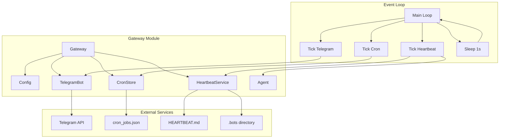
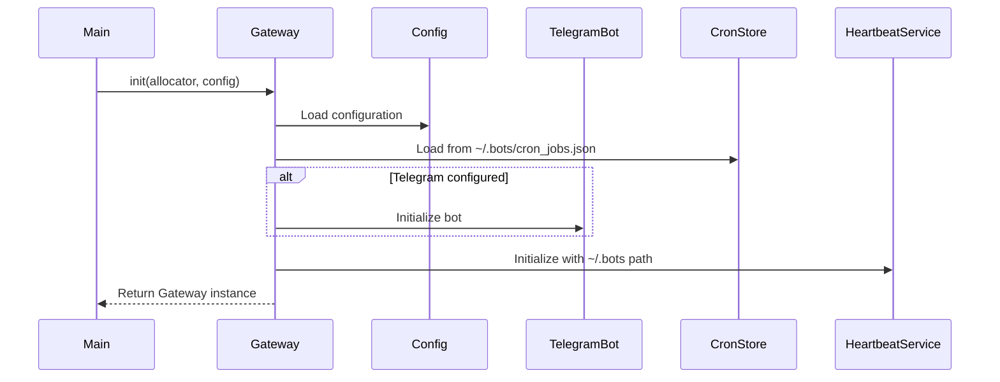

# Gateway Module Documentation

## Overview

The Gateway module is the central orchestrator of the satibot system, responsible for coordinating all bot services in a unified event loop. It manages the Telegram bot, cron jobs, and heartbeat monitoring services.

## Architecture



## Components

### Gateway Struct

The main container that holds and coordinates all services:

```zig
pub const Gateway = struct {
    allocator: std.mem.Allocator,      // Memory allocator
    config: Config,                    // Application configuration
    tg_bot: ?TelegramBot,              // Optional Telegram bot instance
    cron: CronStore,                   // Cron job manager
    heartbeat: HeartbeatService,       // Heartbeat monitoring service
}
```

### Service Initialization Flow



### Event Loop Flow

```mermaid
flowchart TD
    START([Gateway Started]) --> INIT{Services Initialized?}
    INIT -->|Yes| LOG[Log service status]
    INIT -->|No| ERROR[Handle initialization error]
    
    LOG --> LOOP[Enter Main Loop]
    LOOP --> TG_CHECK{Telegram bot enabled?}
    TG_CHECK -->|Yes| TG_TICK[bot.tick()]
    TG_CHECK -->|No| SKIP_TG
    TG_TICK --> TG_ERROR{Error occurred?}
    TG_ERROR -->|Yes| LOG_TG_ERR[Log error]
    TG_ERROR -->|No| SKIP_TG
    SKIP_TG --> CRON_TICK[cron.tick()]
    
    CRON_TICK --> CRON_ERROR{Error occurred?}
    CRON_ERROR -->|Yes| LOG_CRON_ERR[Log error]
    CRON_ERROR -->|No| SKIP_HB
    LOG_CRON_ERR --> SKIP_HB
    
    SKIP_HB --> SLEEP[Sleep 1 second]
    SLEEP --> LOOP
    
    ERROR --> END([Exit])
```

## Key Features

### 1. Service Coordination

- Manages three main services: Telegram bot, cron jobs, and heartbeat monitoring
- Each service runs independently in the main event loop
- Errors in one service don't affect others

### 2. Configuration-Driven

- Telegram bot is optional and only initialized if configured
- All services respect the provided configuration

### 3. Graceful Error Handling

- Each service tick is wrapped in error handling
- Errors are logged but don't crash the application
- Initialization failures for non-critical services are handled gracefully

### 4. Resource Management

- Proper initialization and deinitialization of all resources
- Uses the provided allocator consistently
- File paths are constructed and freed properly

## Usage Example

```zig
const Gateway = @import("gateway.zig").Gateway;

// Initialize configuration
var config = Config.init(...);

// Create gateway
var gateway = try Gateway.init(allocator, config);
defer gateway.deinit();

// Run the main event loop
try gateway.run();
```

## Service Details

### Telegram Bot Service

- Handles incoming Telegram messages
- Processes commands and interactions
- Only active if `config.tools.telegram` is configured

### Cron Service

- Manages scheduled tasks
- Loads jobs from `~/.bots/cron_jobs.json`
- Executes jobs based on their schedule

### Heartbeat Service (Currently Disabled)

- Monitors for periodic tasks
- Checks `HEARTBEAT.md` for new instructions
- Runs an agent to process any found tasks

## Configuration Requirements

```json
{
  "agents": {
    "defaults": {
      "model": "gpt-4"
    }
  },
  "providers": {
    "anthropic": {
      "api_key": "your-api-key"
    }
  },
  "tools": {
    "telegram": {
      "bot_token": "your-bot-token",
      "chat_id": "your-chat-id"
    },
    "web": {
      "search": {}
    }
  }
}
```

## File Structure

The Gateway expects the following directory structure:

```
~/
└── .bots/
    ├── cron_jobs.json    # Cron job definitions
    └── HEARTBEAT.md      # Heartbeat instructions (when enabled)
```

## Performance Considerations

- The main loop runs every second
- Each service tick should be fast to prevent blocking
- Long-running operations should be handled asynchronously
- Memory is allocated from the provided allocator

## Testing

The module includes a basic test that verifies:

- Gateway initialization with minimal configuration
- Proper handling of optional Telegram bot
- Correct service setup

Run tests with:

```bash
zig test src/agent/gateway.zig
```

## Future Enhancements

1. **Async Event Loop**: Migrate to an async/await pattern for better concurrency
2. **Service Health Checks**: Add health monitoring for each service
3. **Dynamic Configuration**: Support for runtime configuration updates
4. **Metrics Collection**: Add performance metrics and monitoring
5. **Service Discovery**: Support for pluggable services
