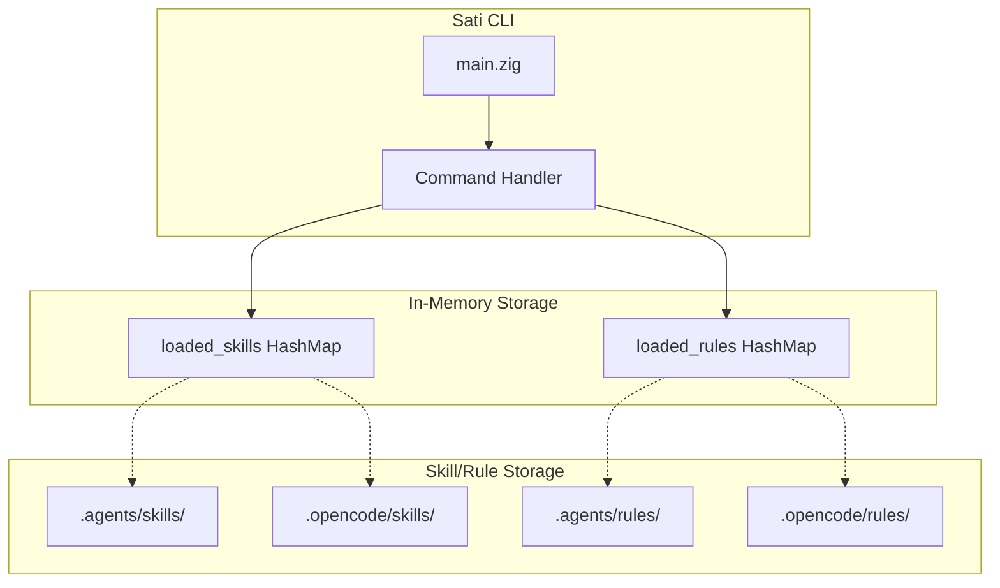
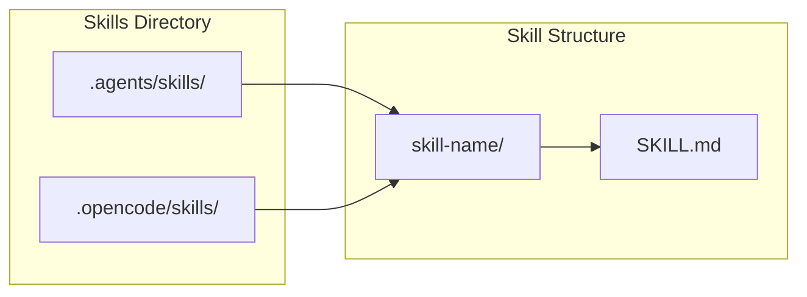
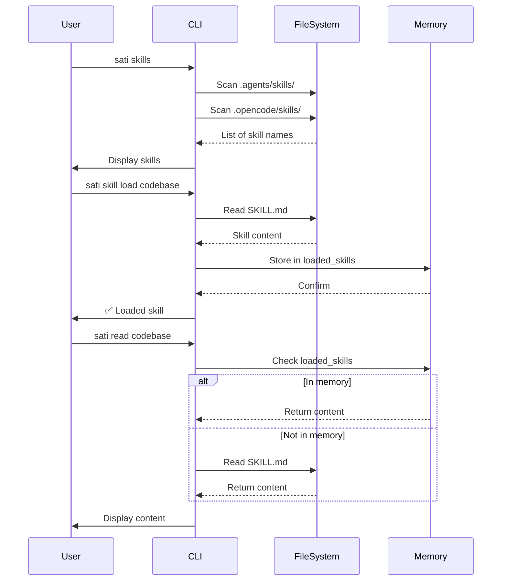
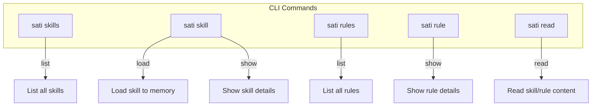
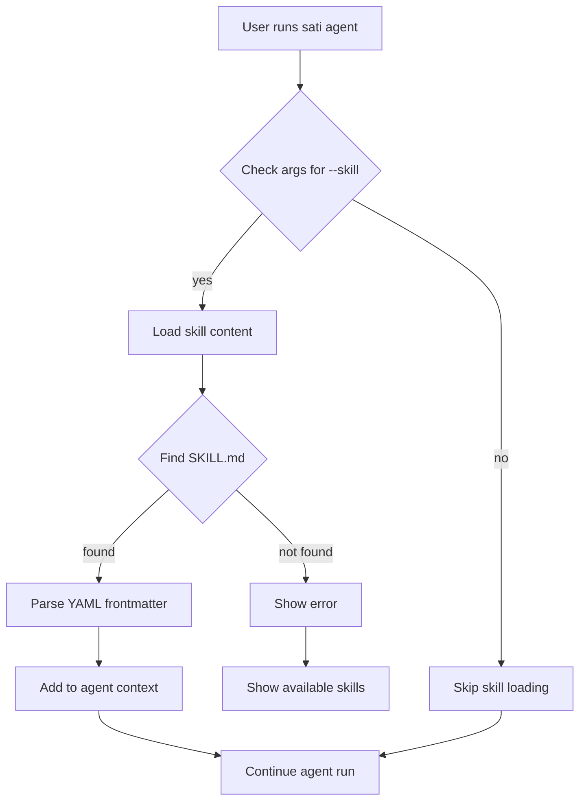
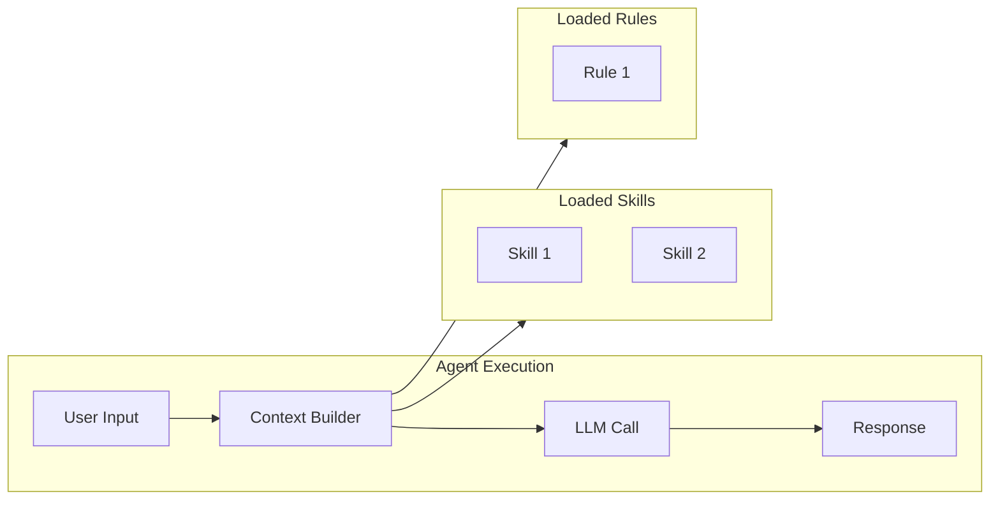

# Skill & Rule System

This document describes the Skill and Rule management system in SatiBot CLI, inspired by OpenCode and Claude Code.

## Overview

SatiBot CLI provides a skill and rule management system that allows the AI agent to load specialized knowledge and coding conventions on-demand.

## Architecture



## Directory Structure



Skills are stored in directories with a `SKILL.md` file:

```
.agents/skills/<name>/SKILL.md
.opencode/skills/<name>/SKILL.md
```

Rules are stored as individual markdown files:

```
.agents/rules/<name>.md
.opencode/rules/<name>.md
```

## SKILL.md Format

```yaml
---
name: skill-name
description: Brief description of what this skill provides
---

# Skill Name

Detailed documentation content...
```

## Command Flow



## Available Commands



## Skill Loading Flow



## Use Cases

### 1. Codebase Context Loading

```bash
# Load codebase skill before running agent
sati agent --skill codebase

# Or load multiple skills
sati agent --skill codebase --skill zig-best-practices
```

### 2. On-Demand Rule Lookup

```bash
# Check naming conventions
sati rule zig-naming-conventions

# Check debug print rules
sati rule zig-debug-print
```

### 3. Skill Exploration

```bash
# List all available skills
sati skills

# Read full skill content
sati read codebase

# Read specific rule
sati read llm-best-practices
```

## Integration with Agent



When running the agent with loaded skills/rules, they are injected into the system prompt to provide additional context:

```
System: You are a helpful AI assistant.
[Skill: codebase] Project structure: ...
[Skill: zig-best-practices] Use patterns: ...
[Rule: zig-naming-conventions] camelCase, snake_case, ...
```

## Adding New Skills

1. Create directory: `.agents/skills/my-skill/`
2. Add `SKILL.md` with YAML frontmatter
3. Document purpose, usage, and examples
4. Test with `sati skill my-skill`

## Adding New Rules

1. Add file: `.agents/rules/my-rule.md`
2. Start with `# Rule Title` on first line
3. Document the rule with examples
4. Test with `sati rule my-rule`

## Example Skills

| Skill | Description |
|-------|-------------|
| `codebase` | Project structure and key files |
| `zig-best-practices` | Zig coding patterns |
| `http-fetch` | HTTP fetching capabilities |
| `app-logic` | Application flow diagrams |

## Example Rules

| Rule | Description |
|------|-------------|
| `zig-naming-conventions` | Naming rules for Zig |
| `zig-debug-print` | Debug print usage |
| `llm-best-practices` | LLM interaction best practices |
| `zig-0.15-quick-reference` | Zig 0.15 breaking changes |

## Testing

Run tests for the skill/rule system:

```bash
zig build test
```

Unit tests verify:
- Description extraction from YAML frontmatter
- First line extraction for rules
- File reading and parsing
- HashMap storage operations
