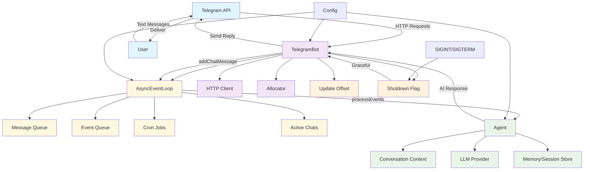
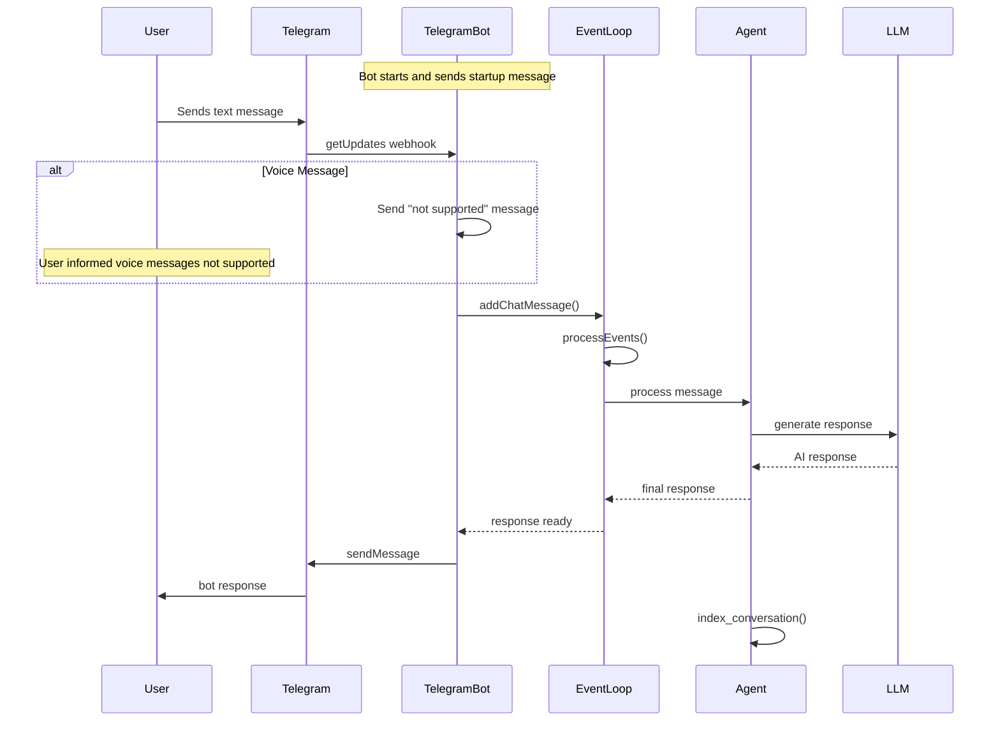
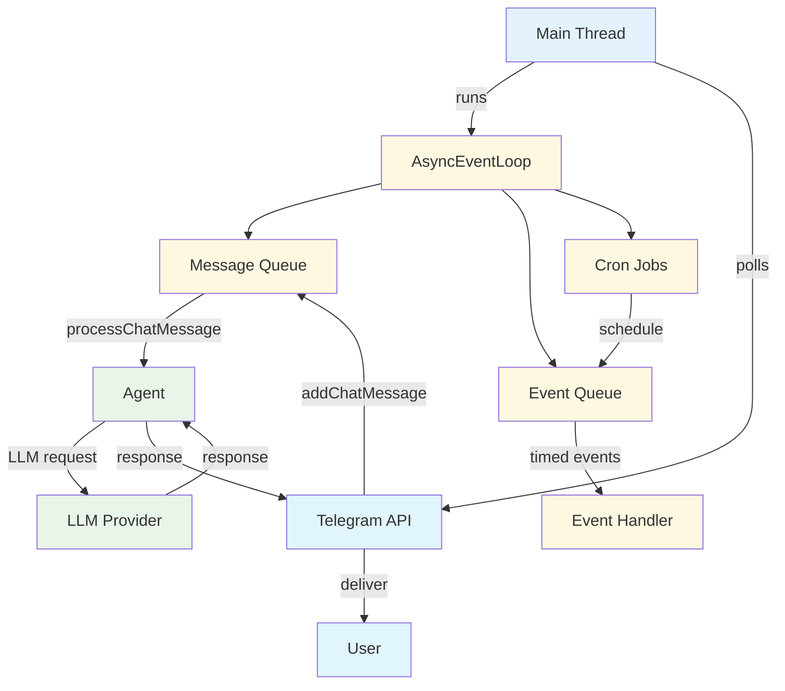
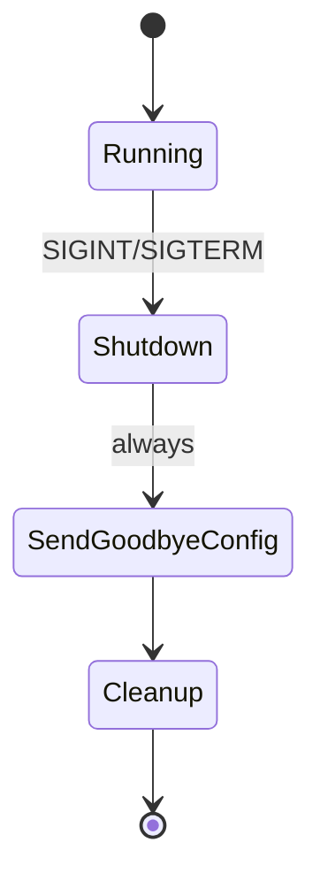

# Telegram Bot Documentation

## Overview

The Telegram Bot is an event loop-based implementation that manages interactions with the Telegram Bot API using long-polling. It processes text messages asynchronously through an event-driven architecture and maintains conversation sessions with AI agents.

## Architecture

## Key Components

### TelegramBot Struct

- **Purpose**: Main bot implementation that handles Telegram API interactions
- **Key Fields**:
  - `allocator`: Memory management for string operations and JSON parsing
  - `config`: Bot configuration including API tokens and provider settings
  - `event_loop`: AsyncEventLoop for concurrent message processing
  - `offset`: Long-polling offset to prevent duplicate message processing
  - `client`: HTTP client with keep-alive for efficient API calls

### AsyncEventLoop

- **Purpose**: Event-driven message processing and cron job management
- **Key Components**:
  - `message_queue`: Queue for immediate message processing
  - `event_queue`: Priority queue for timed events
  - `cron_jobs`: HashMap for scheduled tasks
  - `active_chats`: List tracking active conversations

### Global State

- **`shutdown_requested`**: Atomic flag for graceful shutdown

## Message Processing Flow

## Command Handling

The bot supports several magic commands:

### `/help`

- **Purpose**: Display available commands
- **Response**: Shows command list and usage instructions

### `/setibot`

- **Purpose**: Generate default configuration file
- **Action**: Creates `~/.bots/config.json` with template
- **Features**: Handles existing config gracefully

### `/new`

- **Purpose**: Clear conversation session memory
- **Action**: Deletes session file and starts fresh conversation
- **Variant**: `/new <prompt>` clears session then processes prompt

## Event Loop Architecture

### Event Loop Coordination

- **Main Thread**: Handles Telegram API polling and event loop execution
- **Message Queue**: Immediate processing of incoming chat messages
- **Event Queue**: Priority-based processing of timed events
- **Cron Jobs**: Scheduled tasks with configurable intervals
- **Agent Processing**: Synchronous AI response generation
- **Resource Management**: Automatic cleanup and memory management

## Error Handling

### Robustness Features

- **Network Errors**: Retry with 5-second delay on `tick()` failures
- **JSON Parsing**: Optional fields handle missing data gracefully
- **Event Loop Errors**: Isolated to prevent bot crashes
- **Resource Cleanup**: Proper defer blocks for memory management

### Graceful Shutdown

## Configuration Requirements

### Required Fields

- `tools.telegram.botToken`: Bot authentication token
- `tools.telegram.chatId`: Default chat for startup messages

### Optional Fields

- `providers.*`: Various LLM provider configurations

## Memory Management

### Session Storage

- **Location**: `~/.bots/sessions/{session_id}.json`
- **Format**: JSON conversation history
- **Cleanup**: Manual via `/new` command

### Active Chat Tracking

- **Purpose**: Track active conversations within the event loop
- **Management**: Handled internally by AsyncEventLoop
- **Lifecycle**: Created on first message, cleaned on shutdown
- **Thread Safety**: Mutex-protected within event loop

## HTTP Client Configuration

- **Timeout**: 60 seconds for all requests
- **Keep-Alive**: Enabled for connection reuse
- **TLS**: Handshake optimization for long-running operations

## Debug Logging

The bot provides extensive debug output:

- Message processing status
- Error details with context
- Shutdown process tracking
- Active chat management

## Performance Considerations

### Long-Polling Optimization

- **Timeout**: 5 seconds to reduce empty responses
- **Offset Management**: Prevents duplicate processing
- **Connection Reuse**: Keep-alive reduces overhead

### Event Loop Processing

- **Non-blocking**: Event loop processes messages efficiently
- **Queue-based**: Message and event queues prevent blocking
- **Resource Efficient**: No thread spawning overhead
- **Scalable**: Handles multiple concurrent conversations

## Security Notes

- **Token Protection**: Never log or expose bot tokens
- **Input Validation**: JSON parsing with unknown field ignored
- **Memory Safety**: Proper cleanup of allocated strings
