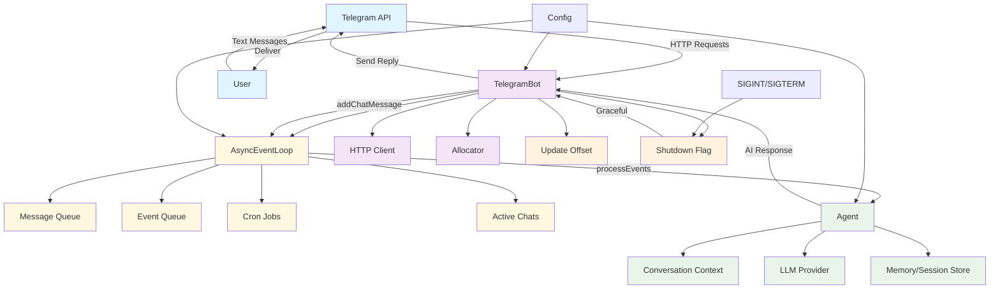
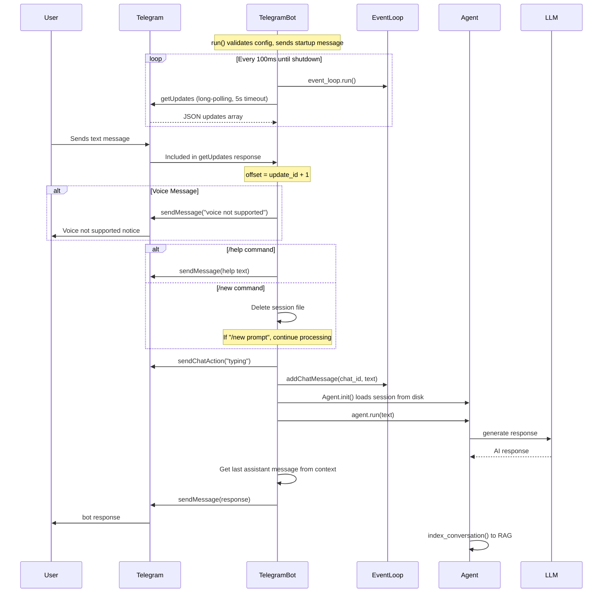
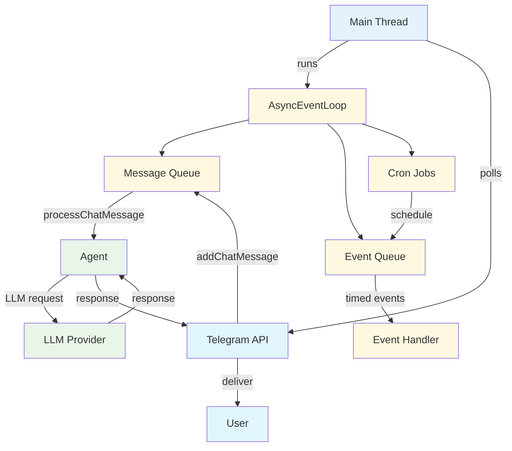
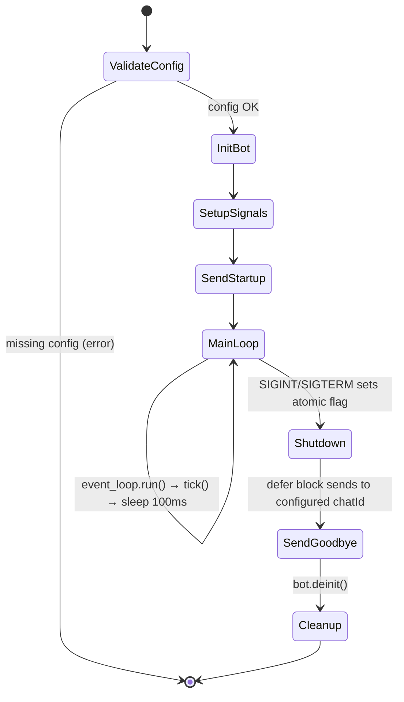

# Telegram Bot Documentation

## Overview

The Telegram Bot is an event loop-based implementation that manages interactions with the Telegram Bot API using long-polling. It processes text messages asynchronously through an event-driven architecture and maintains conversation sessions with AI agents.

Source code: `src/agent/telegram_bot.zig`.

## Architecture



## Key Components

### TelegramBot Struct

- **Purpose**: Main bot implementation that handles Telegram API interactions
- **Key Fields**:
  - `allocator`: Memory management for string operations and JSON parsing
  - `config`: Bot configuration including API tokens and provider settings
  - `event_loop`: `AsyncEventLoop` for concurrent message processing
  - `offset`: `i64` long-polling offset (default `0`), prevents duplicate message processing
  - `client`: `http.Client` with keep-alive for efficient API calls
- **Methods**:
  - `init()`: Creates HTTP client (60s timeout, keep-alive) and event loop
  - `deinit()`: Cleans up event loop and HTTP connections
  - `tick()`: Single polling iteration - fetches updates, processes messages, sends replies
  - `send_chat_action()`: Sends typing indicators to Telegram
  - `send_message()`: Sends text messages via Telegram API

### `run()` Entry Point

- **Purpose**: Main entry point for the Telegram Bot service
- **Flow**:
  1. Validates `telegram` config exists (returns `TelegramConfigNotFound` if missing)
  2. Initializes bot instance
  3. Sets up SIGINT/SIGTERM signal handlers
  4. Validates `chatId` is configured (returns `TelegramChatIdNotConfigured` if missing)
  5. Sends startup message to configured chat
  6. Enters main loop: `event_loop.run()` → check shutdown → `tick()` → sleep 100ms
  7. On shutdown: sends goodbye message to configured chat via defer block

### AsyncEventLoop

- **Purpose**: Event-driven message processing and cron job management
- **Key Components**:
  - `message_queue`: Queue for immediate message processing
  - `event_queue`: Priority queue for timed events
  - `cron_jobs`: HashMap for scheduled tasks
  - `active_chats`: List tracking active conversations

### Global State

- **`shutdown_requested`**: `std.atomic.Value(bool)` with `seq_cst` ordering for thread-safe shutdown signaling

## Message Processing Flow



## Command Handling

The bot supports two magic commands (detected via `std.mem.startsWith`):

### `/help`

- **Purpose**: Display available commands
- **Response**: Shows command list (`/new`, `/help`) and usage instructions
- **Behavior**: Sends help text and skips further processing (`continue`)

### `/new`

- **Purpose**: Clear conversation session memory
- **Action**: Deletes session file at `~/.bots/sessions/tg_{chat_id}.json`
- **Variant**: `/new` alone sends confirmation and skips processing
- **Variant**: `/new <prompt>` clears session then processes `<prompt>` with a fresh agent

### Session ID Format

- **Pattern**: `tg_{chat_id}` (e.g., `tg_123456789`)
- **Storage**: `~/.bots/sessions/tg_{chat_id}.json`

## Event Loop Architecture



### Event Loop Coordination

- **Main Thread**: Handles Telegram API polling and event loop execution
- **Message Queue**: Immediate processing of incoming chat messages
- **Event Queue**: Priority-based processing of timed events
- **Cron Jobs**: Scheduled tasks with configurable intervals
- **Agent Processing**: Synchronous AI response generation
- **Resource Management**: Automatic cleanup and memory management

## Error Handling

### Robustness Features

- **Network Errors**: Retry with 5-second delay on `tick()` failures
- **Event Loop Errors**: Retry with 5-second delay on `event_loop.run()` failures
- **Agent Errors**: Caught per-message, sends error notice to user, does not crash bot
- **JSON Parsing**: `ignore_unknown_fields = true`, optional fields handle missing data
- **Resource Cleanup**: Proper `defer` blocks for all allocations (`allocPrint`, `path.join`, etc.)
- **Typing Indicator**: `send_chat_action` errors are silently ignored (`catch {}`)
- **RAG Indexing**: `index_conversation()` errors are silently ignored (`catch {}`)

### Graceful Shutdown



## Configuration Requirements

### Required Fields

- `tools.telegram.botToken`: Bot authentication token
- `tools.telegram.chatId`: Default chat for startup messages

### Optional Fields

- `providers.*`: Various LLM provider configurations

## Memory Management

### JSON-Based Session Storage

The bot uses **JSON-based memory** stored in `~/.bots/sessions/` directory:

- **Storage Format**: JSON files named `{session_id}.json`
- **Location**: `~/.bots/sessions/` (shared across bot instances)
- **Structure**: Each session contains an array of `LLMMessage` objects

### Memory Components

#### Session Module (`src/agent/session.zig`)

- **Purpose**: Persistent conversation storage
- **Functions**:
  - `save()`: Serializes messages to JSON with 2-space indentation
  - `load()`: Deserializes JSON back to memory structures
  - `saveToPath()`/`load_internal()`: Low-level file operations

#### Context Module (`src/agent/context.zig`)

- **Purpose**: In-memory conversation management
- **Structure**: `ArrayListUnmanaged(LLMMessage)` for efficient message storage
- **Operations**: Add messages, retrieve conversation history

#### Message Structure

```zig
pub const LLMMessage = struct {
    role: []const u8,           // "user", "assistant", "system", "tool"
    content: ?[]const u8,       // Message text (optional for tool results)
    tool_call_id: ?[]const u8,  // Tool call identifier
    tool_calls: ?[]const ToolCall, // Array of tool calls
};
```

### Memory Flow to LLM

#### Session Loading (Agent initialization)

```zig
// In Agent.init()
if (session.load(allocator, session_id)) |history| {
    for (history) |msg| {
        self.ctx.add_message(msg) catch {};
    }
}
```

#### Memory Transmission to LLM

1. **Context Retrieval**: `self.ctx.get_messages()` returns all conversation messages
2. **Provider Integration**: Messages sent directly to LLM providers (Anthropic, Groq, etc.)
3. **Complete History**: Entire conversation context included in each LLM request

#### Session Persistence

```zig
// After each message processing
try session.save(self.allocator, self.session_id, self.ctx.get_messages());
```

### Long-Term Memory (RAG)

The bot also implements **Retrieval-Augmented Generation**:

#### index_conversation()

- Concatenates all message content into full text
- Creates embeddings using `get_embeddings()`
- Stores in vector database via `vector_upsert()`
- Enables semantic search across conversation history

### Session Management Features

#### Session Commands

- `/new`: Clears session file, starts fresh conversation
- `/new <prompt>`: Clears session then processes immediate prompt

#### Memory Safety

- Deep copying of all strings to prevent memory corruption
- Proper cleanup with `deinit()` methods
- Tool call data duplication for independence

#### Session Error Handling

- Graceful handling of missing session files (returns empty array)
- JSON parsing with `ignore_unknown_fields = true`
- 10MB file size limit for session loading

### JSON Session Example

```json
{
  "messages": [
    {
      "role": "user",
      "content": "Hello, how are you?"
    },
    {
      "role": "assistant", 
      "content": "I'm doing well, thank you!"
    },
    {
      "role": "user",
      "content": "Can you help me with Zig programming?"
    }
  ]
}
```

### Active Chat Tracking

- **Purpose**: Track active conversations within the event loop
- **Management**: Handled internally by AsyncEventLoop
- **Lifecycle**: Created on first message, cleaned on shutdown
- **Thread Safety**: Mutex-protected within event loop

## Telegram API Methods

The bot uses three Telegram Bot API endpoints:

- **`getUpdates`**: `GET /bot{token}/getUpdates?offset={n}&timeout=5` - Long-polling for new messages
- **`sendMessage`**: `POST /bot{token}/sendMessage` - Send text replies to users
- **`sendChatAction`**: `POST /bot{token}/sendChatAction` - Show "typing" indicator

### Request Format

- **Content-Type**: `application/json`
- **Body**: JSON with `chat_id` + `text` (sendMessage) or `action` (sendChatAction)
- **Response Parsing**: `UpdateResponse` struct defined inline in `tick()` with `ignore_unknown_fields`

## HTTP Client Configuration

- **Timeout**: 60 seconds for all requests
- **Keep-Alive**: Enabled for connection reuse
- **TLS**: Handshake optimization for long-running operations

## Debug Logging

The bot provides extensive debug output:

- Message processing status
- Error details with context
- Shutdown process tracking
- Active chat management

## Performance Considerations

### Long-Polling Optimization

- **Timeout**: 5-second server-side wait reduces empty responses
- **Offset Management**: `self.offset = update_id + 1` prevents duplicate processing
- **Connection Reuse**: Keep-alive HTTP client reduces TLS handshake overhead
- **Polling Interval**: 100ms sleep between cycles prevents CPU spinning

### Event Loop Processing

- **Non-blocking**: Event loop processes messages efficiently
- **Queue-based**: Message and event queues prevent blocking
- **Resource Efficient**: No thread spawning overhead
- **Scalable**: Handles multiple concurrent conversations

### Agent Lifecycle

- **Per-message**: A fresh `Agent` is created for each incoming message
- **Session Loading**: Agent loads history from disk on init
- **Session Saving**: Agent saves updated history after `run()` completes
- **Cleanup**: Agent is deinitialized via `defer` after each message

## Security Notes

- **Token Protection**: Never log or expose bot tokens
- **Input Validation**: JSON parsing with `ignore_unknown_fields = true`
- **Memory Safety**: Proper cleanup of all allocated strings via `defer`
- **Voice Messages**: Rejected with user-facing notice (not processed)

## Unit Tests

The file includes the following tests (lines 365-492):

- **`TelegramBot lifecycle`**: Init/deinit, offset defaults to 0
- **`TelegramBot tick returns if no config`**: `tick()` returns early when telegram config is null
- **`TelegramBot config validation`**: Verifies fields are accessible after init
- **`TelegramBot session ID generation`**: `tg_{chat_id}` format validation
- **`TelegramBot command detection - /new`**: `startsWith` logic for `/new` and `/new <prompt>`
- **`TelegramBot message JSON serialization`**: JSON output contains expected fields
- **`TelegramBot config file template generation`**: Template contains all required config keys
