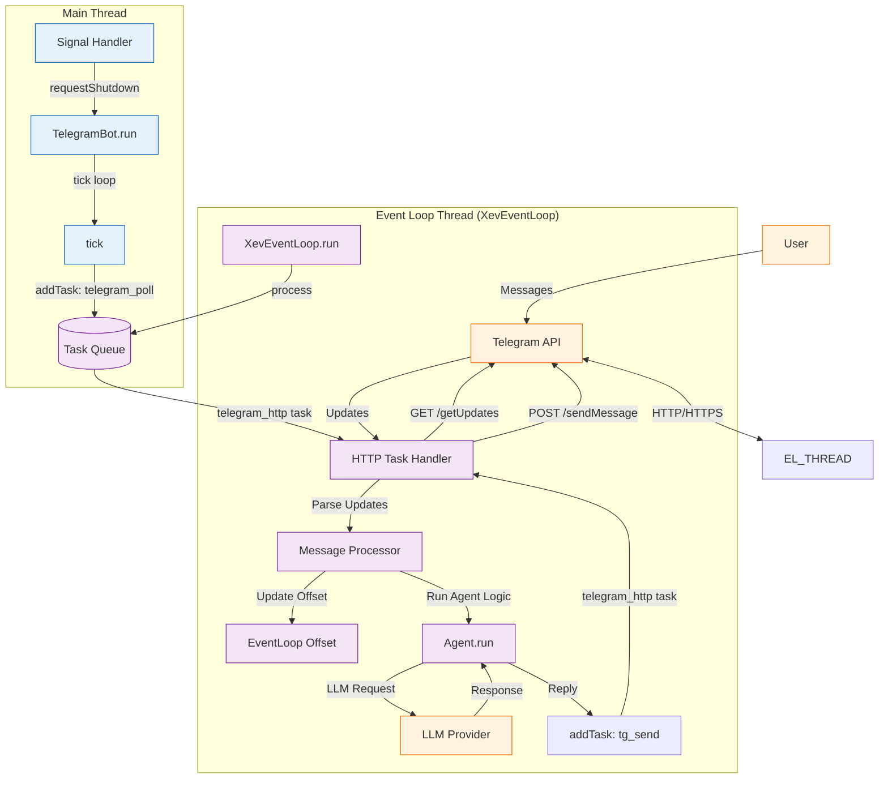
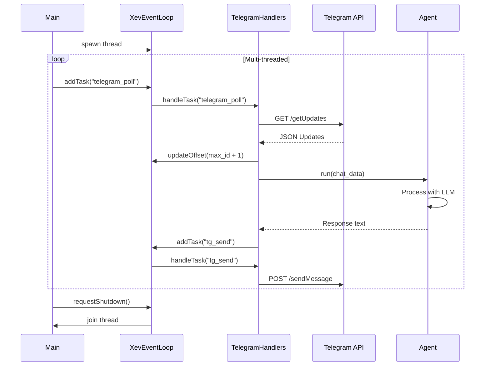

# Xev-based Telegram Bot Documentation

## Overview

The `XevTelegramBot` is a modern, event-driven implementation of the Telegram Bot API for satibot. It leverages the `libxev` event loop (wrapped in `XevEventLoop`) for efficient asynchronous I/O and task management.

Unlike the legacy implementation, this version centralizes all HTTP operations through the event loop, allowing for better concurrency and resource management.

Source code: `src/agent/xev_telegram_bot.zig`.

## Architecture

The bot operates using a dual-thread model:

1. **Main Thread**: Handles the high-level polling logic (`tick`) and signal management.
2. **Event Loop Thread**: Executes all I/O operations (HTTP requests), processes message logic via `Agent`, and manages background tasks.



## Logic Flow

### 1. Initialization

When `TelegramBot.init` is called:

- It initializes the `XevEventLoop`.
- It sets up a shared `http.Client`.
- It creates a `TelegramContext` which stores references to the allocator, config, and event loop.
- It registers `telegram_handlers` for tasks and events.

### 2. Polling Loop (`tick`)

The main thread repeatedly calls `tick()`:

- It constructs a `getUpdates` URL using the current offset from the event loop.
- It adds a task named `telegram_poll` with the source `telegram_http` to the event loop.
- It then sleeps for 100ms to prevent tight-looping while the event loop handles the actual network I/O.

### 3. Task Handling

The `XevEventLoop` processes the `telegram_poll` task:

- The task handler identifies it as an HTTP request.
- It performs the HTTP GET request to Telegram.
- The response is parsed for new messages.
- For each message, it either:
  - Processes it directly in the current handler.
  - Adds a new task to the event loop for message processing.
- **CRITICAL**: The `update_id` of the last message is used to update the polling offset for the next request.

### 4. Message Processing

When a message is processed:

- The agent logic is executed for the specific `chat_id` using the current conversation context.
- The `Agent` processes the message through the configured LLM provider.
- If a response is generated, it is sent back to Telegram using `sendMessageToTelegram` (which adds a `tg_send` task to the loop).

### 5. Graceful Shutdown

- Upon receiving `SIGINT` or `SIGTERM`, the signal handler sets a global shutdown flag.
- The main thread breaks the `tick` loop.
- A shutdown message is sent to the configured chat.
- The event loop is requested to stop, and its thread is joined.

## Key Components

| Component         | Description                                                              |
|-------------------|--------------------------------------------------------------------------|
| `TelegramBot`     | The main struct managing the bot lifecycle and polling.                  |
| `XevEventLoop`    | The core engine that executes tasks and manages timers/IO.               |
| `TelegramContext` | Holds shared state for handlers, including the polling offset.           |
| `telegram_handlers` | Logic for parsing Telegram updates and dispatching to `Agent`.       |
| `Agent`           | The AI controller that handles conversation history and LLM interaction. |

## Sequence Diagram



## Mock Bot for Testing

For local development and testing without a Telegram connection, you can use the `MockBot`. It simulates the Telegram environment by reading from the console (stdin) and processing messages through the same `XevEventLoop` and `Agent` logic.

### Running the Mock Bot

```bash
zig build run-mock-bot
```

### Running Mock Bot Tests

```bash
zig build test-mock-bot
```
