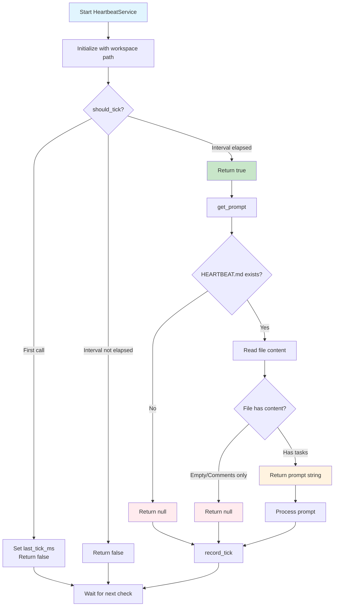

# Heartbeat Service Documentation

## Overview

The `HeartbeatService` is a periodic background task checker that monitors a `HEARTBEAT.md` file in the workspace for tasks that need attention. It runs every 30 minutes by default and provides prompts when the heartbeat file contains actionable items.

## Architecture

```zig
pub const HeartbeatService = struct {
    allocator: std.mem.Allocator,        // Memory allocator for string operations
    interval_s: u64 = 1800,             // Check interval in seconds (30 minutes)
    last_tick_ms: i64 = 0,              // Timestamp of last heartbeat check
    workspace_path: []const u8,         // Path to the monitored workspace
};
```

## Logic Flow



## Core Methods

### `init(allocator, workspace_path)`

Initializes the heartbeat service with the given allocator and workspace path.

### `should_tick()`

Checks if enough time has passed since the last tick:

- First call initializes `last_tick_ms` and returns `false`
- Subsequent calls return `true` only if the configured interval has elapsed

### `get_prompt()`

Reads and processes the `HEARTBEAT.md` file:

1. Constructs the full path to `HEARTBEAT.md`
2. Opens and reads the file (up to 1MB)
3. Checks if the file contains meaningful content
4. Returns a prompt string if tasks are found, `null` otherwise

### `is_empty(content)`

Determines if the heartbeat file content is empty by:

- Ignoring empty lines
- Skipping comment lines (starting with `#`)
- Skipping HTML comments (`<!-- ... -->`)
- Returns `true` if no meaningful content is found

### `record_tick()`

Updates the `last_tick_ms` timestamp to the current time.

## Usage Example

```zig
const allocator = std.heap.page_allocator;
var service = HeartbeatService.init(allocator, "/path/to/workspace");

// In your main loop:
if (service.should_tick()) {
    if (service.get_prompt()) |prompt| {
        // Process the prompt (e.g., send to AI agent)
        process_prompt(prompt);
        allocator.free(prompt);
    }
    service.record_tick();
}
```

## Use Case Examples

### 1. AI Assistant with Periodic Tasks

An AI assistant that needs to perform regular maintenance tasks:

```zig
const std = @import("std");

pub fn main() !void {
    var gpa = std.heap.GeneralPurposeAllocator(.{}){};
    defer _ = gpa.deinit();
    const allocator = gpa.allocator();
    
    // Initialize heartbeat service for the workspace
    var heartbeat = HeartbeatService.init(allocator, "/home/user/project");
    defer heartbeat.allocator.free(heartbeat.workspace_path);
    
    // Main application loop
    while (true) {
        // Check for heartbeat tasks every 30 minutes
        if (heartbeat.should_tick()) {
            if (heartbeat.get_prompt()) |prompt| {
                // Send prompt to AI for processing
                const response = try process_with_ai(prompt);
                std.debug.print("AI Response: {s}\n", .{response});
                allocator.free(prompt);
                allocator.free(response);
            }
            heartbeat.record_tick();
        }
        
        // Handle other application logic
        handle_user_requests();
        
        // Sleep for a reasonable check interval
        std.Thread.sleep(5 * std.time.ns_per_s);
    }
}
```

### 2. Build System with Health Checks

A build system that monitors project health:

```zig
// HEARTBEAT.md content example:
/*
# Build System Health Checks

- [ ] Check for outdated dependencies
- [ ] Run security vulnerability scan
- [ ] Verify build cache integrity
- [ ] Clean up temporary artifacts older than 7 days
- [ ] Generate build statistics report
*/

pub fn run_build_monitor(workspace_path: []const u8) !void {
    const allocator = std.heap.page_allocator;
    var heartbeat = HeartbeatService.init(allocator, workspace_path);
    
    // Configure for more frequent checks during development
    heartbeat.interval_s = 600; // 10 minutes
    
    while (true) {
        if (heartbeat.should_tick()) {
            if (heartbeat.get_prompt()) |prompt| {
                // Execute build maintenance tasks
                const tasks = parse_tasks_from_prompt(prompt);
                for (tasks) |task| {
                    execute_build_task(task) catch |err| {
                        std.log.err("Failed to execute task: {}", .{err});
                    };
                }
                allocator.free(prompt);
            }
            heartbeat.record_tick();
        }
        
        std.Thread.sleep(60 * std.time.ns_per_s); // Check every minute
    }
}
```

### 3. Microservice with Background Jobs

A microservice that performs periodic background operations:

```zig
pub const Microservice = struct {
    allocator: std.mem.Allocator,
    heartbeat: HeartbeatService,
    job_queue: *JobQueue,
    
    pub fn init(allocator: std.mem.Allocator, workspace: []const u8) !Microservice {
        return .{
            .allocator = allocator,
            .heartbeat = HeartbeatService.init(allocator, workspace),
            .job_queue = try JobQueue.init(allocator),
        };
    }
    
    pub fn run(self: *Microservice) !void {
        // Spawn heartbeat checker in background
        const heartbeat_thread = try std.Thread.spawn(.{}, Self.heartbeat_loop, .{self});
        defer heartbeat_thread.join();
        
        // Main service logic
        while (self.service_running) {
            self.handle_api_requests();
        }
    }
    
    fn heartbeat_loop(self: *Microservice) !void {
        while (self.service_running) {
            if (self.heartbeat.should_tick()) {
                if (self.heartbeat.get_prompt()) |prompt| {
                    // Queue background jobs based on heartbeat
                    const jobs = try parse_jobs_from_prompt(prompt);
                    for (jobs) |job| {
                        try self.job_queue.enqueue(job);
                    }
                    self.heartbeat.allocator.free(prompt);
                }
                self.heartbeat.record_tick();
            }
            
            std.Thread.sleep(30 * std.time.ns_per_s);
        }
    }
};
```

### 4. Development Environment with Automated Tasks

A development environment that runs automated tasks:

```zig
// In your development tool:
pub fn start_dev_env(workspace: []const u8) !void {
    var heartbeat = HeartbeatService.init(std.heap.page_allocator, workspace);
    
    // Create initial HEARTBEAT.md if it doesn't exist
    const heartbeat_path = try std.fs.path.join(
        std.heap.page_allocator, 
        &.{ workspace, "HEARTBEAT.md" }
    );
    defer std.heap.page_allocator.free(heartbeat_path);
    
    std.fs.createFileAbsolute(heartbeat_path, .{}) catch |err| {
        if (err != error.PathAlreadyExists) return err;
    };
    
    // Run in background
    const handle = try std.Thread.spawn(.{}, dev_env_loop, .{&heartbeat});
    handle.detach();
}

fn dev_env_loop(heartbeat: *HeartbeatService) !void {
    while (true) {
        if (heartbeat.should_tick()) {
            if (heartbeat.get_prompt()) |prompt| {
                // Execute development tasks
                run_dev_tasks(prompt) catch |err| {
                    std.log.err("Dev task failed: {}", .{err});
                };
                heartbeat.allocator.free(prompt);
            }
            heartbeat.record_tick();
        }
        
        std.Thread.sleep(60 * std.time.ns_per_s);
    }
}
```

## Comparison with Cron Jobs

The HeartbeatService is similar to cron jobs but designed for different use cases:

### Similarities

- Both run tasks periodically at configured intervals
- Both can automate repetitive maintenance tasks
- Both support configurable execution frequencies

### Key Differences

| Feature | HeartbeatService | Cron Job |
|---------|------------------|----------|
| **Task Definition** | Dynamic tasks in HEARTBEAT.md file | Static configuration in crontab |
| **Flexibility** | Tasks can be modified without code changes | Requires editing crontab |
| **Context** | Runs within your application context | Independent system process |
| **Resource Access** | Direct access to application state/memory | Limited to external commands |
| **Scheduling** | Simple interval-based (every X seconds) | Complex schedules (specific times, days) |
| **Platform** | Cross-platform (works anywhere Zig runs) | Unix/Linux only |
| **Persistence** | No persistence across restarts | Persistent across reboots |
| **Logging** | Integrated with application logs | Separate system logs |

### When to Use HeartbeatService

- Tasks need access to application state
- Dynamic task configuration is required
- Cross-platform compatibility is needed
- Tasks should be part of the application lifecycle

### When to Use Cron

- System-level maintenance tasks
- Tasks must run even when application is offline
- Complex scheduling requirements (e.g., "every Friday at 2 AM")
- Running external commands/scripts

## Best Practices

1. **Memory Management**: Always free the returned prompt string after use
2. **Error Handling**: Handle file I/O errors gracefully
3. **Thread Safety**: Use mutexes if accessing from multiple threads
4. **Configuration**: Adjust interval based on your needs (e.g., shorter for development)
5. **Logging**: Log heartbeat activities for debugging
6. **Resource Cleanup**: Ensure proper cleanup of allocated resources

## HEARTBEAT.md Format

The `HEARTBEAT.md` file should contain tasks or instructions that need periodic attention:

```markdown
# Heartbeat Tasks

- Check database backups
- Review error logs
- Update documentation

<!-- This is a comment and will be ignored -->
```

Empty files, files with only headers/comments, or non-existent files will not trigger a prompt.

## Testing

The service includes comprehensive tests that verify:

- Timing logic with configurable intervals
- File reading with empty and non-empty files
- Proper memory management
- Edge cases like missing files

## Configuration

- **Default interval**: 30 minutes (1800 seconds)
- **Maximum file size**: 1MB (1048576 bytes)
- **Supported file**: `HEARTBEAT.md` in workspace root

## Thread Safety

The service is not thread-safe. If using in a multi-threaded context, ensure proper synchronization when accessing `should_tick()`, `get_prompt()`, and `record_tick()`.
