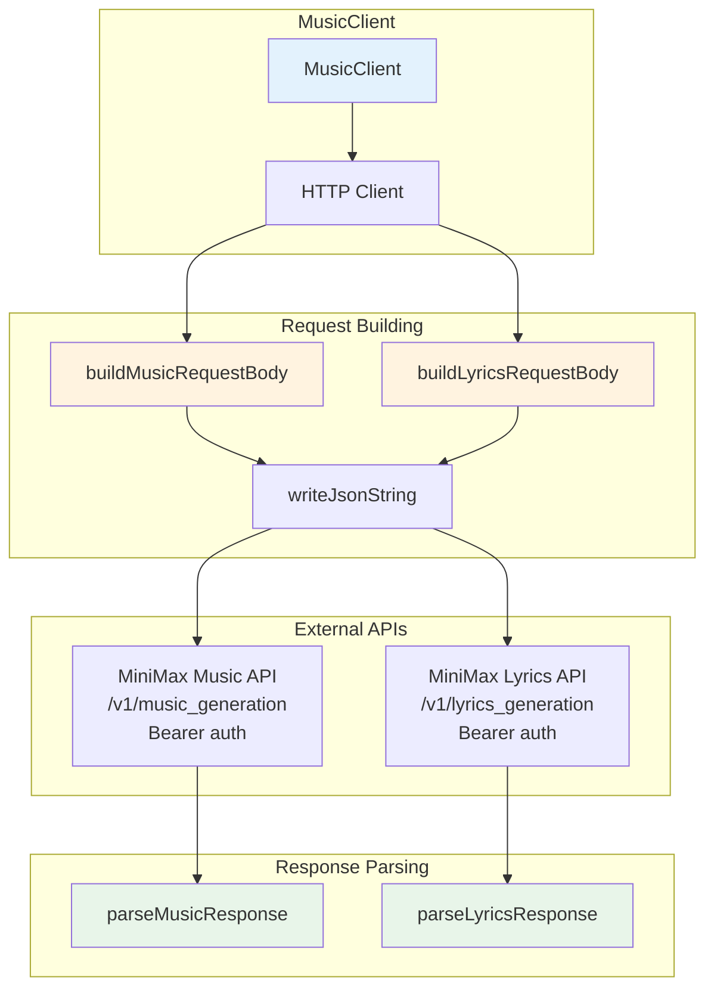

# MiniMax Music API - SatiBot Integration

## Overview

The MiniMax Music API enables music and lyrics generation through SatiBot. This module provides a Zig implementation for generating music from prompts and lyrics.

## Features

- **Music Generation**: Create music from style prompts and lyrics
- **Lyrics Generation**: Generate song lyrics from themes
- **Configurable Audio**: Sample rate, bitrate, and format options
- **Streaming Response**: URL-based output for audio retrieval

## Architecture

### Logic Graph



## API Reference

### Endpoints

- **Base URL**: `https://api.minimax.io`
- **Music Generation**: `/v1/music_generation`
- **Lyrics Generation**: `/v1/lyrics_generation`
- **Authentication**: `Bearer` token in `Authorization` header

### Structs

#### AudioSetting

Audio output configuration.

```zig
pub const AudioSetting = struct {
    sample_rate: u32 = 44100,
    bitrate: u32 = 256000,
    format: []const u8 = "mp3",
};
```

#### MusicGenerationRequest

Request for music generation.

```zig
pub const MusicGenerationRequest = struct {
    model: []const u8 = "music-2.5",
    prompt: []const u8,
    lyrics: []const u8 = "",
    audio_setting: AudioSetting = .{},
    output_format: []const u8 = "url",
};
```

#### LyricsGenerationRequest

Request for lyrics generation.

```zig
pub const LyricsGenerationRequest = struct {
    mode: []const u8 = "write_full_song",
    prompt: []const u8,
};
```

#### MusicClient

Main client for music/lyrics generation.

```zig
pub const MusicClient = struct {
    allocator: std.mem.Allocator,
    client: http.Client,
    api_key: []const u8,
    api_base: []const u8 = "https://api.minimax.io",
};
```

### Methods

- `init(allocator, api_key)` - Create client instance
- `deinit()` - Clean up resources
- `generateMusic(request)` - Generate music from prompt/lyrics
- `generateLyrics(request)` - Generate lyrics from theme

## Usage Examples

### Initialize Client

```zig
var client = try MusicClient.init(allocator, "your-api-key");
defer client.deinit();
```

### Generate Music

```zig
const request: MusicGenerationRequest = .{
    .model = "music-2.5",
    .prompt = "Soulful Blues, Rainy Night, Melancholy, Male Vocals, Slow Tempo",
    .lyrics = 
        \\[Verse 1]
        \\The sky is cryin' tonight...
    ,
    .audio_setting = .{
        .sample_rate = 44100,
        .bitrate = 256000,
        .format = "mp3",
    },
    .output_format = "url",
};

const response = try client.generateMusic(request);
defer response.deinit();

if (response.data) |data| {
    std.debug.print("Audio URL: {s}\n", .{data.audio.?});
}
```

### Generate Lyrics First

```zig
const lyrics_request: LyricsGenerationRequest = .{
    .mode = "write_full_song",
    .prompt = "A soulful blues song about a rainy night",
};

const lyrics_response = try client.generateLyrics(lyrics_request);
defer lyrics_response.deinit();

if (lyrics_response.data) |data| {
    std.debug.print("Generated lyrics:\n{s}\n", .{data.lyrics.?});
}
```

### Full Workflow: Generate Lyrics + Music

```zig
var client = try MusicClient.init(allocator, api_key);
defer client.deinit();

// Step 1: Generate lyrics
const lyrics_req = LyricsGenerationRequest{
    .prompt = "A soulful blues song about a rainy night",
};
const lyrics_resp = try client.generateLyrics(lyrics_req);
defer lyrics_resp.deinit();

// Step 2: Generate music with lyrics
const music_req = MusicGenerationRequest{
    .prompt = "Soulful Blues, Rainy Night, Melancholy",
    .lyrics = lyrics_resp.data.?.lyrics.?,
};
const music_resp = try client.generateMusic(music_req);
defer music_resp.deinit();

// Get the audio URL
if (music_resp.data) |data| {
    std.debug.print("Your song: {s}\n", .{data.audio.?});
}
```

## Music 2.5 Features

The music-2.5 model includes:

- **High Fidelity + Strong Control**
- **Instrumentation & Mixing**: High-sample-rate sound library, optimized soundstage
- **Vocal Performance**: Humanized timbre, enhanced flow expressiveness
- **Structural Precision**: 14+ music structure variants (Intro, Bridge, Chorus, etc.)
- **Sound Design**: Genre-specific mixing characteristics

## Configuration

The music API uses the same API key as the text API. Configure in `~/.bots/config.json`:

```json
{
  "providers": {
    "minimax": {
      "apiKey": "your-minimax-api-key"
    }
  }
}
```

Or set environment variable: `MINIMAX_API_KEY`

## Response Codes

- `code: 0` - Success
- Non-zero codes indicate errors (see `msg` field for details)

## Testing

Run tests with:

```bash
zig test libs/minimax-music/src/music.zig
```

## Error Handling

- `error.ApiRequestFailed` - HTTP request failed
- JSON parsing errors for malformed responses
- Check `response.code` and `response.msg` for API-level errors
