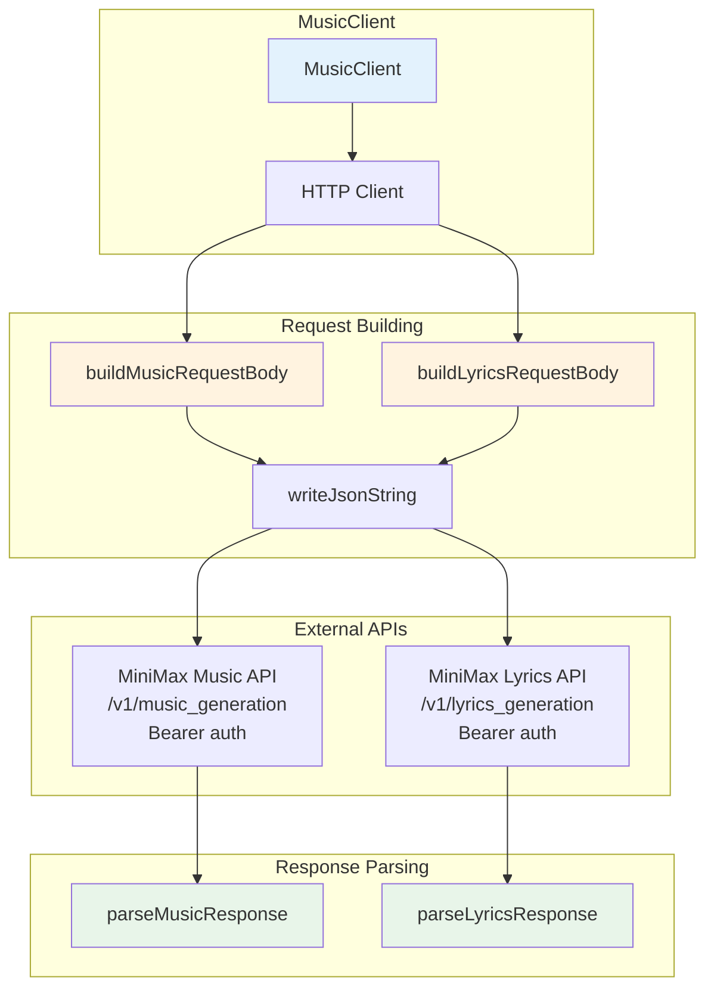

# MiniMax Music API - SatiBot Integration

## Overview

The MiniMax Music API enables music and lyrics generation through SatiBot. This module provides a Zig implementation for generating music from prompts and lyrics.

## Features

- **Music Generation**: Create music from style prompts and lyrics
- **Lyrics Generation**: Generate song lyrics from themes
- **Auto-Generated Lyrics**: Use `lyrics_optimizer` to automatically generate lyrics from prompt
- **Instrumental Music**: Generate instrumental tracks using `is_instrumental` flag
- **Configurable Audio**: Sample rate, bitrate, and format options
- **Multiple Output Formats**: URL or hex-based audio output
- **Request Validation**: Built-in validation for all parameters
- **Enhanced Response Data**: Access to detailed music metadata and analysis

## Architecture

### Logic Graph



## API Reference

### Endpoints

- **Base URL**: `https://api.minimax.io`
- **Music Generation**: `/v1/music_generation`
- **Lyrics Generation**: `/v1/lyrics_generation`
- **Authentication**: `Bearer` token in `Authorization` header

### Structs

#### AudioSetting

Audio output configuration.

```zig
pub const AudioSetting = struct {
    sample_rate: u32 = 44100,
    bitrate: u32 = 256000,
    format: []const u8 = "mp3",
};
```

#### MusicGenerationRequest

Request for music generation.

```zig
pub const MusicGenerationRequest = struct {
    model: []const u8 = "music-2.5+",
    prompt: []const u8,
    lyrics: []const u8 = "",
    audio_setting: AudioSetting = .{},
    output_format: []const u8 = "hex",
    /// Auto-generate lyrics from prompt (default: false)
    lyrics_optimizer: bool = false,
    /// Generate instrumental music (default: false, music-2.5+ only)
    is_instrumental: bool = false,
};
```

**Fields:**
- `model`: Model to use ("music-2.5" or "music-2.5+")
- `prompt`: Music style and description (max 2000 characters)
- `lyrics`: Song lyrics (required unless using `lyrics_optimizer` or `is_instrumental`)
- `audio_setting`: Audio output configuration
- `output_format": "url" or "hex"
- `lyrics_optimizer`: Auto-generate lyrics from prompt
- `is_instrumental`: Generate instrumental music (no vocals)

#### LyricsGenerationRequest

Request for lyrics generation.

```zig
pub const LyricsGenerationRequest = struct {
    mode: []const u8 = "write_full_song",
    prompt: []const u8,
};
```

#### MusicGenerationResponse

Response from music generation API.

```zig
pub const MusicGenerationResponse = struct {
    allocator: std.mem.Allocator,
    code: i32,
    msg: []const u8,
    data: ?MusicData = null,
    trace_id: ?[]const u8 = null,
    extra_info: ?ExtraInfo = null,
    analysis_info: ?std.json.Value = null,
};
```

#### MusicData

Contains the generated audio information.

```zig
pub const MusicData = struct {
    audio: ?[]const u8 = null,
    audio_type: ?[]const u8 = null,
    status: ?i32 = null,
};
```

#### ExtraInfo

Additional metadata about the generated music.

```zig
pub const ExtraInfo = struct {
    music_duration: ?i64 = null,
    music_sample_rate: ?i32 = null,
    music_channel: ?i32 = null,
    bitrate: ?i32 = null,
    music_size: ?i64 = null,
};
```

#### LyricsGenerationResponse

Response from lyrics generation API.

```zig
pub const LyricsGenerationResponse = struct {
    allocator: std.mem.Allocator,
    code: i32,
    msg: []const u8,
    data: ?LyricsData = null,
    song_title: ?[]const u8 = null,
    style_tags: ?[]const u8 = null,
};
```

#### MusicClient

Main client for music/lyrics generation.

```zig
pub const MusicClient = struct {
    allocator: std.mem.Allocator,
    client: http.Client,
    api_key: []const u8,
    api_base: []const u8 = "https://api.minimax.io",
};
```

### Methods

- `init(allocator, api_key)` - Create client instance
- `deinit()` - Clean up resources
- `generateMusic(request)` - Generate music from prompt/lyrics
- `generateLyrics(request)` - Generate lyrics from theme

### Validation

The `generateMusic` method automatically validates requests:
- Prompt length: max 2000 characters
- Lyrics length: max 3500 characters (required unless `is_instrumental` or `lyrics_optimizer`)
- Sample rate: 16000, 24000, 32000, or 44100 Hz
- Bitrate: 32000, 64000, 128000, or 256000
- Format: "mp3", "wav", or "pcm"
- Model: "music-2.5" or "music-2.5+"
- Output format: "url" or "hex"

## Usage Examples

### Initialize Client

```zig
var client = try MusicClient.init(allocator, "your-api-key");
defer client.deinit();
```

### Generate Music

```zig
const request: MusicGenerationRequest = .{
    .model = "music-2.5+",
    .prompt = "Soulful Blues, Rainy Night, Melancholy, Male Vocals, Slow Tempo",
    .lyrics = 
        \\[Verse 1]
        \\The sky is cryin' tonight...
    ,
    .audio_setting = .{
        .sample_rate = 44100,
        .bitrate = 256000,
        .format = "mp3",
    },
    .output_format = "hex",
    .lyrics_optimizer = false,
    .is_instrumental = false,
};

const response = try client.generateMusic(request);
defer response.deinit();

if (response.data) |data| {
    std.debug.print("Audio: {s}\n", .{data.audio.?});
}

// Access additional metadata
if (response.extra_info) |info| {
    if (info.music_duration) |duration| {
        std.debug.print("Duration: {d} seconds\n", .{duration});
    }
}
```

### Generate Lyrics First

```zig
const lyrics_request: LyricsGenerationRequest = .{
    .mode = "write_full_song",
    .prompt = "A soulful blues song about a rainy night",
};

const lyrics_response = try client.generateLyrics(lyrics_request);
defer lyrics_response.deinit();

if (lyrics_response.data) |data| {
    std.debug.print("Generated lyrics:\n{s}\n", .{data.lyrics.?});
}

// Access additional metadata
if (lyrics_response.song_title) |title| {
    std.debug.print("Song Title: {s}\n", .{title});
}
if (lyrics_response.style_tags) |tags| {
    std.debug.print("Style Tags: {s}\n", .{tags});
}
```

### Full Workflow: Generate Lyrics + Music

```zig
var client = try MusicClient.init(allocator, api_key);
defer client.deinit();

// Step 1: Generate lyrics
const lyrics_req = LyricsGenerationRequest{
    .prompt = "A soulful blues song about a rainy night",
};
const lyrics_resp = try client.generateLyrics(lyrics_req);
defer lyrics_resp.deinit();

// Step 2: Generate music with lyrics
const music_req = MusicGenerationRequest{
    .model = "music-2.5+",
    .prompt = "Soulful Blues, Rainy Night, Melancholy",
    .lyrics = lyrics_resp.data.?.lyrics.?,
    .output_format = "hex",
};
const music_resp = try client.generateMusic(music_req);
defer music_resp.deinit();

// Get the audio data
if (music_resp.data) |data| {
    std.debug.print("Your song: {s}\n", .{data.audio.?});
}
```

## Music 2.5+ Features

The music-2.5+ model includes all music-2.5 features plus:

- **Enhanced Audio Quality**: Improved fidelity and clarity
- **Better Instrument Separation**: Cleaner mixing and mastering
- **Extended Duration Support**: Longer music generation capabilities
- **Hex Output Format**: Direct audio data output without URL intermediate

### Advanced Examples

#### Generate Music with Auto-Optimized Lyrics

```zig
const request = MusicGenerationRequest{
    .model = "music-2.5+",
    .prompt = "Epic orchestral battle music, dramatic, intense",
    .lyrics_optimizer = true,  // Auto-generate lyrics
    .output_format = "hex",
    .audio_setting = .{
        .sample_rate = 44100,
        .bitrate = 256000,
        .format = "mp3",
    },
};

const response = try client.generateMusic(request);
```

#### Generate Instrumental Music

```zig
const request = MusicGenerationRequest{
    .model = "music-2.5+",
    .prompt = "Jazz piano trio, smooth, late night, improvisation",
    .is_instrumental = true,  // No vocals
    .output_format = "hex",
};
```

#### Access Detailed Response Information

```zig
const response = try client.generateMusic(request);

// Basic response info
std.debug.print("Status: {d}\n", .{response.code});
std.debug.print("Message: {s}\n", .{response.msg});

// Trace ID for debugging
if (response.trace_id) |trace_id| {
    std.debug.print("Trace ID: {s}\n", .{trace_id});
}

// Detailed music metadata
if (response.extra_info) |info| {
    std.debug.print("Duration: {d}s\n", .{info.music_duration.?});
    std.debug.print("Sample Rate: {d}Hz\n", .{info.music_sample_rate.?});
    std.debug.print("Channels: {d}\n", .{info.music_channel.?});
    std.debug.print("File Size: {d} bytes\n", .{info.music_size.?});
}

// Analysis information (JSON format)
if (response.analysis_info) |analysis| {
    // Process analysis data as needed
    std.debug.print("Analysis: {}\n", .{analysis});
}
```

## Music 2.5 Features

The music-2.5 model includes:

- **High Fidelity + Strong Control**
- **Instrumentation & Mixing**: High-sample-rate sound library, optimized soundstage
- **Vocal Performance**: Humanized timbre, enhanced flow expressiveness
- **Structural Precision**: 14+ music structure variants (Intro, Bridge, Chorus, etc.)
- **Sound Design**: Genre-specific mixing characteristics

## Configuration

The music API uses the same API key as the text API. Configure in `~/.bots/config.json`:

```json
{
  "providers": {
    "minimax": {
      "apiKey": "your-minimax-api-key"
    }
  }
}
```

Or set environment variable: `MINIMAX_API_KEY`

## Response Codes

- `code: 0` - Success
- Non-zero codes indicate errors (see `msg` field for details)

## Testing

Run tests with:

```bash
zig test libs/minimax-music/src/music.zig
```

## Error Handling

### HTTP/API Errors

- `error.ApiRequestFailed` - HTTP request failed
- JSON parsing errors for malformed responses
- Check `response.code` and `response.msg` for API-level errors

### Validation Errors

The `generateMusic` method validates requests and can return:
- `error.PromptTooLong` - Prompt exceeds 2000 characters
- `error.LyricsRequired` - Lyrics required when not using `lyrics_optimizer` or `is_instrumental`
- `error.LyricsTooLong` - Lyrics exceed 3500 characters
- `error.InvalidSampleRate` - Must be 16000, 24000, 32000, or 44100 Hz
- `error.InvalidBitrate` - Must be 32000, 64000, 128000, or 256000
- `error.InvalidAudioFormat` - Must be "mp3", "wav", or "pcm"
- `error.InvalidModel` - Must be "music-2.5" or "music-2.5+"
- `error.InvalidOutputFormat` - Must be "url" or "hex"

### Example Error Handling

```zig
const response = client.generateMusic(request) catch |err| {
    switch (err) {
        error.PromptTooLong => std.debug.print("Error: Prompt too long (max 2000 chars)\n"),
        error.LyricsRequired => std.debug.print("Error: Lyrics required for non-instrumental music\n"),
        error.InvalidSampleRate => std.debug.print("Error: Invalid sample rate\n"),
        error.ApiRequestFailed => std.debug.print("Error: API request failed\n"),
        else => std.debug.print("Error: {}\n", .{err}),
    }
    return;
};
```
