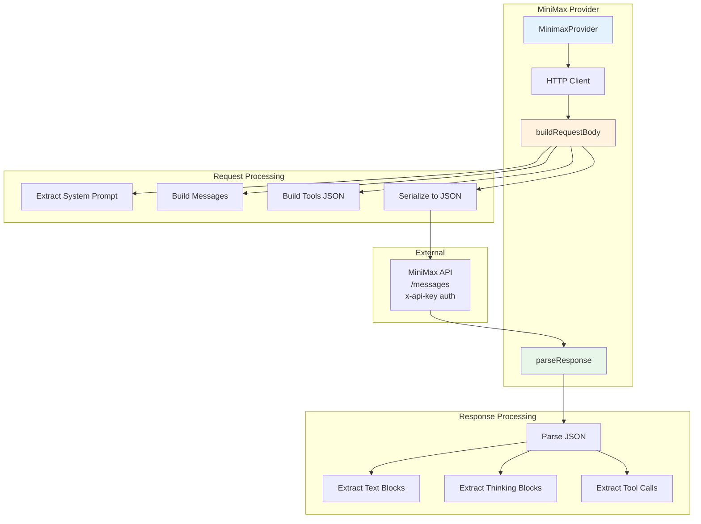

# MiniMax Provider Documentation

## Overview

The MiniMax provider provides access to MiniMax's language models through their Anthropic-compatible API. It follows the same functional programming approach as other providers, separating pure logic from I/O operations.

## Features

- **Synchronous Chat**: Blocking chat completions
- **Streaming Responses**: Real-time SSE streaming with chunk callbacks
- **Tool/Function Calling**: Full OpenAI-compatible tool calling support
- **Thinking Blocks**: Support for reasoning/thinking content in responses
- **Error Handling**: Detailed error messages from API responses

## Architecture

### Logic Graph



## API Reference

### Endpoints

- **Base URL**: `https://api.minimax.io/anthropic`
- **Messages Endpoint**: `/messages`
- **Authentication**: `x-api-key` header

### Structs

#### MinimaxProvider

Main provider struct holding HTTP client and configuration.

```zig
pub const MinimaxProvider = struct {
    allocator: std.mem.Allocator,
    client: http.Client,
    api_key: []const u8,
    api_base: []const u8 = "https://api.minimax.io/anthropic",
};
```

#### ContentBlock

Response content block types.

```zig
const ContentBlock = struct {
    type: []const u8,        // "text", "thinking", "tool_use"
    text: ?[]const u8 = null,
    thinking: ?[]const u8 = null,
    id: ?[]const u8 = null,
    name: ?[]const u8 = null,
    input: ?std.json.Value = null,
};
```

### Methods

#### Initialization

- `init(allocator, api_key)` - Create provider instance
- `deinit()` - Clean up resources

#### Chat Operations

- `chat(messages, model, tools)` - Synchronous chat completion
- `chatStream(messages, model, tools, callback, ctx)` - Streaming chat with SSE

### Pure Functions

- `buildRequestBody(messages, model, tools, stream)` - Build JSON request body
- `parseResponse(body)` - Parse API response into LlmResponse

## Usage Examples

### Basic Chat Completion

```zig
var provider = try MinimaxProvider.init(allocator, "your-api-key");
defer provider.deinit();

const messages = &[_]base.LlmMessage{
    .{ .role = "user", .content = "Hello, world!" },
};

const response = try provider.chat(messages, "MiniMax-M2.5", null);
defer response.deinit();

std.debug.print("Response: {s}\n", .{response.content.?});
```

### Streaming Chat

```zig
const chunkCallback = struct {
    fn func(ctx: ?*anyopaque, chunk: []const u8) void {
        std.debug.print("Chunk: {s}\n", .{chunk});
    }
}.func;

const response = try provider.chatStream(
    messages,
    "MiniMax-text-01",
    null,
    chunkCallback,
    null
);
defer response.deinit();
```

## Configuration

Add MiniMax to your `~/.bots/config.json`:

```json
{
  "agents": {
    "defaults": {
      "model": "MiniMax-M2.5"
    }
  },
  "providers": {
    "minimax": {
      "apiKey": "your-minimax-api-key"
    }
  }
}
```

Or set environment variable: `MINIMAX_API_KEY`

## Supported Models

- `MiniMax-M2.5` - General purpose text model (recommended)
- Other MiniMax models can be specified by name

## Thinking Blocks

MiniMax responses can include thinking blocks for reasoning transparency:

```zig
// Thinking content is extracted and included in response.content
// alongside text blocks
```

## Error Handling

- `error.ApiRequestFailed` - HTTP request failed
- `error.NoChoicesReturned` - Empty response from API
- JSON parsing errors for malformed responses

## Testing

Run tests with:

```bash
zig test src/providers/minimax.zig
```
