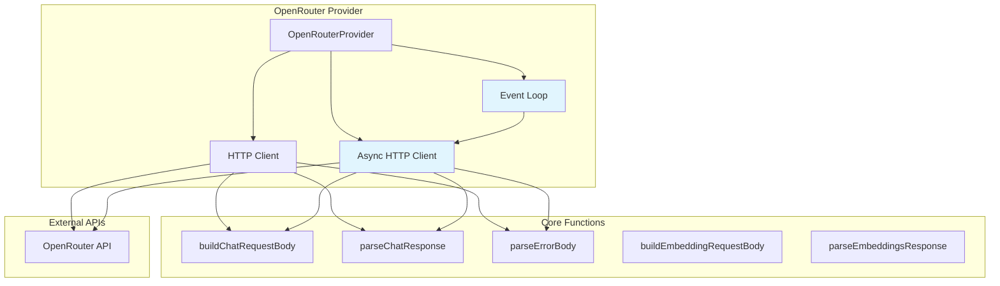
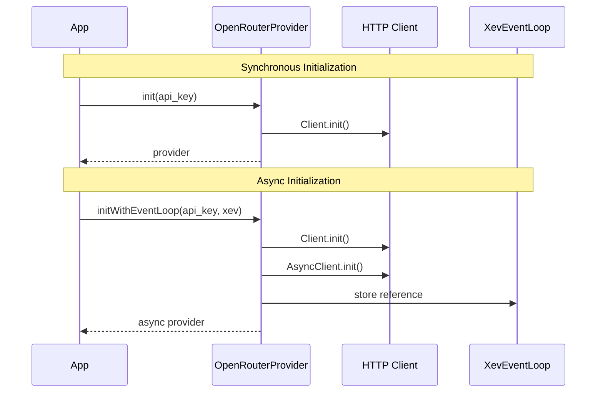

# OpenRouter Provider Documentation

## Overview

The OpenRouter provider is a high-performance, async-capable implementation that provides unified access to multiple LLM models through the OpenRouter API. It's designed with a functional programming approach, separating pure logic from I/O operations.

## Features

- **Synchronous & Asynchronous Chat**: Support for both blocking and non-blocking chat completions
- **Streaming Responses**: Real-time streaming of chat responses with chunk callbacks
- **Tool/Function Calling**: Full support for OpenAI-compatible tool calling
- **Embeddings**: Text embedding generation for vector search
- **Rate Limit Handling**: Automatic rate limit detection and reporting
- **Event Loop Integration**: Optional integration with XevEventLoop for async operations

## Architecture

### Logic Graph



### Initialization Patterns



## API Reference

### Structs

#### OpenRouterProvider

Main provider struct holding HTTP clients and configuration.

```zig
pub const OpenRouterProvider = struct {
    allocator: std.mem.Allocator,
    client: http.Client,
    async_client: ?http_async.AsyncClient,
    api_key: []const u8,
    api_base: []const u8,
    event_loop: ?*XevEventLoop,
};
```

#### CompletionResponse

Response structure for chat completions.

```zig
pub const CompletionResponse = struct {
    id: []const u8,
    model: []const u8,
    choices: []Choice,
};
```

#### ChatAsyncResult

Result structure for async operations.

```zig
pub const ChatAsyncResult = struct {
    request_id: []const u8,
    success: bool,
    response: ?base.LLMResponse,
    err_msg: ?[]const u8,
};
```

### Methods

#### Initialization

- `init(allocator, api_key)` - Create synchronous provider
- `initWithEventLoop(allocator, api_key, event_loop)` - Create async-capable provider
- `deinit()` - Clean up resources

#### Chat Operations

- `chat(messages, model, tools)` - Synchronous chat completion
- `chatAsync(request_id, messages, model, tools, callback)` - Asynchronous chat
- `chatStream(messages, model, tools, callback, ctx)` - Streaming chat

#### Other Operations

- `embeddings(request)` - Generate text embeddings

### Pure Functions

These functions are separated from I/O for better testability:

- `buildChatRequestBody(allocator, messages, model, tools, stream)` - Build JSON request
- `parseChatResponse(allocator, body)` - Parse API response
- `parseErrorBody(allocator, body)` - Parse error responses
- `parseEmbeddingsResponse(allocator, body)` - Parse embedding responses
- `processStreamResponse(allocator, response, callback, ctx)` - Process streaming data

## Usage Examples

### Basic Chat Completion

```zig
const allocator = std.heap.page_allocator;
var provider = try OpenRouterProvider.init(allocator, "your-api-key");
defer provider.deinit();

const messages = &[_]base.LLMMessage{
    .{ .role = "user", .content = "Hello, world!" },
};

const response = try provider.chat(messages, "openai/gpt-3.5-turbo", null);
defer response.deinit();

std.debug.print("Response: {s}\n", .{response.content.?});
```

### Async Chat with Event Loop

```zig
var event_loop = try XevEventLoop.init(allocator);
defer event_loop.deinit();

var provider = try OpenRouterProvider.initWithEventLoop(
    allocator, 
    "your-api-key", 
    &event_loop
);
defer provider.deinit();

const callback = struct {
    fn func(result: ChatAsyncResult) void {
        if (result.success) {
            std.debug.print("Async response: {s}\n", .{result.response.?.content.?});
            result.response.?.deinit();
        } else {
            std.debug.print("Error: {s}\n", .{result.err_msg.?});
        }
    }
}.func;

try provider.chatAsync("req-123", messages, "openai/gpt-4", null, &callback);
```

### Streaming Chat

```zig
const chunkCallback = struct {
    fn func(ctx: ?*anyopaque, chunk: []const u8) void {
        std.debug.print("Chunk: {s}\n", .{chunk});
    }
}.func;

const response = try provider.chatStream(
    messages,
    "openai/gpt-3.5-turbo",
    null,
    chunkCallback,
    null
);
defer response.deinit();
```

### Tool Calling

```zig
const tools = &[_]base.ToolDefinition{
    .{
        .name = "get_weather",
        .description = "Get current weather",
        .parameters = "{\"type\": \"object\", \"properties\": {\"location\": {\"type\": \"string\"}}}",
    },
};

const response = try provider.chat(messages, "openai/gpt-3.5-turbo", tools);
defer response.deinit();

if (response.tool_calls) |calls| {
    for (calls) |call| {
        std.debug.print("Tool call: {s} with args: {s}\n", .{ call.function.name, call.function.arguments });
    }
}
```

## Error Handling

The provider uses Zig's error union system for comprehensive error handling:

- `error.ApiRequestFailed` - HTTP request failed
- `error.AsyncNotInitialized` - Async operations without event loop
- `error.NoChoicesReturned` - Empty response from API
- JSON parsing errors for malformed responses

## Performance Considerations

1. **Memory Management**: All allocated memory is tracked and must be freed
2. **Rate Limits**: Automatic rate limit detection helps avoid throttling
3. **Async Operations**: Use event loop for non-blocking operations
4. **Streaming**: Prefer streaming for long responses to reduce latency

## Testing

Run tests with:

```bash
zig test src/providers/openrouter.zig
```

The provider includes comprehensive unit tests for:

- Struct initialization and cleanup
- Pure function logic
- Request building and response parsing
- Error handling scenarios
- Async operation validation
- ChatAsyncResult lifecycle management

### Async Testing

Async operations are tested by:

1. Verifying `AsyncNotInitialized` error when not initialized with event loop
2. Testing ChatAsyncResult creation and cleanup
3. Validating callback function signatures

Note: Full async integration tests require an event loop instance and are typically done in integration test suites.

## Integration with Event Loop

When initialized with an event loop, the provider can:

- Execute HTTP requests asynchronously
- Handle multiple concurrent requests
- Integrate with other async operations

The event loop integration is optional - the provider works perfectly in synchronous mode as well.
