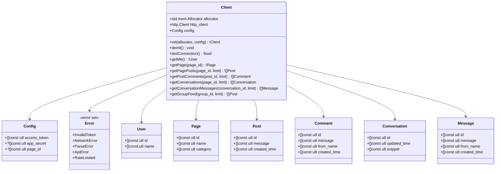

# Facebook Graph API Library - Documentation

## Overview

The Facebook library provides a Zig client for interacting with the Facebook Graph API (v21.0). It enables reading pages, groups, threads, and comments through the Facebook Marketing API endpoints.

## Architecture

### Logic Graph

```mermaid
graph TB
    subgraph "Facebook Client"
        Client[Client]
        BuildUrl[buildUrl]
        Get[get]
    end
    
    subgraph "Pure Functions"
        UrlEncode[urlEncode]
    end
    
    subgraph "API Endpoints"
        Me[/me]
        Page[/page_id]
        Posts[/posts]
        Comments[/comments]
        Conversations[/conversations]
        Messages[/messages]
        Feed[/feed]
    end
    
    subgraph "Parsers"
        ParseUser[parseUser]
        ParsePage[parsePage]
        ParsePosts[parsePosts]
        ParseComments[parseComments]
        ParseConversations[parseConversations]
        ParseMessages[parseMessages]
    end
    
    subgraph "Data Models"
        User[User]
        PageModel[Page]
        Post[Post]
        Comment[Comment]
        Conversation[Conversation]
        Message[Message]
    end
    
    subgraph "External"
        FBAPI[Facebook Graph API]
    end
    
    Client --> BuildUrl
    Client --> Get
    BuildUrl --> UrlEncode
    Get --> FBAPI
    
    Me --> ParseUser
    Page --> ParsePage
    Posts --> ParsePosts
    Comments --> ParseComments
    Conversations --> ParseConversations
    Messages --> ParseMessages
    
    ParseUser --> User
    ParsePage --> PageModel
    ParsePosts --> Post
    ParseComments --> Comment
    ParseConversations --> Conversation
    ParseMessages --> Message
    
    style Client fill:#e3f2fd
    style FBAPI fill:#ffcdd2
```

### UML Class Diagram



## API Reference

### Config

Configuration structure for the Facebook client.

```zig
pub const Config = struct {
    access_token: []const u8,
    app_secret: ?[]const u8 = null,
    page_id: ?[]const u8 = null,
};
```

**Fields:**
- `access_token` (required): Facebook API access token
- `app_secret` (optional): Facebook app secret for additional verification
- `page_id` (optional): Default page ID for operations

### Client

Main client struct for Facebook API interactions.

```zig
pub const Client = struct {
    allocator: std.mem.Allocator,
    http_client: http.Client,
    config: Config,
};
```

#### Methods

##### init

```zig
pub fn init(allocator: std.mem.Allocator, config: Config) !Client
```

Creates a new Facebook client instance.

##### deinit

```zig
pub fn deinit(self: *Client) void
```

Cleans up client resources.

##### testConnection

```zig
pub fn testConnection(self: *Client) !bool
```

Tests the API connection by calling the `/me` endpoint.

**Returns:** `true` if connection is successful, `false` otherwise.

##### getMe

```zig
pub fn getMe(self: *Client) !User
```

Gets the current authenticated user's information.

##### getPage

```zig
pub fn getPage(self: *Client, page_id: []const u8) !Page
```

Gets page details by page ID.

##### getPagePosts

```zig
pub fn getPagePosts(self: *Client, page_id: []const u8, limit: u32) ![]Post
```

Gets posts from a page.

**Parameters:**
- `page_id`: The page ID
- `limit`: Maximum number of posts to retrieve

##### getPostComments

```zig
pub fn getPostComments(self: *Client, post_id: []const u8, limit: u32) ![]Comment
```

Gets comments on a post.

##### getConversations

```zig
pub fn getConversations(self: *Client, page_id: []const u8, limit: u32) ![]Conversation
```

Gets conversations for a page (requires `read_page_mailboxes` permission).

##### getConversationMessages

```zig
pub fn getConversationMessages(self: *Client, conversation_id: []const u8, limit: u32) ![]Message
```

Gets messages in a conversation.

##### getGroupFeed

```zig
pub fn getGroupFeed(self: *Client, group_id: []const u8, limit: u32) ![]Post
```

Gets feed posts from a group.

## Data Models

### User

```zig
pub const User = struct {
    id: []const u8,
    name: []const u8,
};
```

### Page

```zig
pub const Page = struct {
    id: []const u8,
    name: []const u8,
    category: []const u8,
};
```

### Post

```zig
pub const Post = struct {
    id: []const u8,
    message: []const u8,
    created_time: []const u8,
};
```

### Comment

```zig
pub const Comment = struct {
    id: []const u8,
    message: []const u8,
    from_name: []const u8,
    created_time: []const u8,
};
```

### Conversation

```zig
pub const Conversation = struct {
    id: []const u8,
    updated_time: []const u8,
    snippet: []const u8,
};
```

### Message

```zig
pub const Message = struct {
    id: []const u8,
    message: []const u8,
    from_name: []const u8,
    created_time: []const u8,
};
```

## Error Handling

The library uses Zig's error union system:

```zig
pub const Error = error{
    InvalidToken,      // Access token is invalid or expired
    NetworkError,      // Network connectivity issues
    ParseError,        // JSON parsing failed
    ApiError,          // Facebook API returned an error
    RateLimited,       // API rate limit exceeded
};
```

## Usage Examples

### Basic Page Posts Retrieval

```zig
const facebook = @import("libs/facebook");

const allocator = std.heap.page_allocator;

const config = facebook.Config{
    .access_token = "your-access-token",
    .page_id = "123456789",
};

var client = try facebook.Client.init(allocator, config);
defer client.deinit();

const posts = try client.getPagePosts("123456789", 25);
defer {
    for (posts) |post| {
        allocator.free(post.id);
        allocator.free(post.message);
        allocator.free(post.created_time);
    }
    allocator.free(posts);
}

for (posts) |post| {
    std.debug.print("Post: {s}\n", .{post.message});
}
```

### Reading Group Feed

```zig
const facebook = @import("libs/facebook");

const config = facebook.Config{
    .access_token = "your-access-token",
};

var client = try facebook.Client.init(allocator, config);
defer client.deinit();

const feed = try client.getGroupFeed("group-id", 50);
defer {
    for (feed) |post| allocator.free(post.message);
    allocator.free(feed);
}
```

### Accessing Conversations

```zig
const facebook = @import("libs/facebook");

var client = try facebook.Client.init(allocator, config);
defer client.deinit();

const conversations = try client.getConversations("page-id", 20);
defer {
    for (conversations) |conv| {
        allocator.free(conv.id);
        allocator.free(conv.updated_time);
        allocator.free(conv.snippet);
    }
    allocator.free(conversations);
}

for (conversations) |conv| {
    std.debug.print("Conversation: {s}\n", .{conv.snippet});
}
```

## Facebook API Permissions

Required permissions for different operations:

| Operation | Required Permissions |
|-----------|---------------------|
| `getMe` | `public_profile` |
| `getPage` | `pages_read_engagement` |
| `getPagePosts` | `pages_read_engagement` |
| `getPostComments` | `pages_read_engagement` |
| `getConversations` | `read_page_mailboxes` |
| `getConversationMessages` | `read_page_mailboxes` |
| `getGroupFeed` | `groups_access_member_info` |

## Testing

Run tests with:

```bash
zig build test
```

## Dependencies

- `libs/http` - HTTP client for API requests
- `std` - Zig standard library

## Notes

- All string allocations are owned by the caller and must be freed
- The library uses the Graph API v21.0 endpoint
- URL encoding is handled automatically for query parameters
