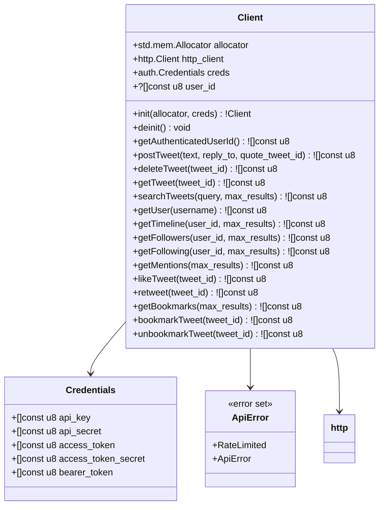

# X (Twitter) API v2 Library - Documentation

## Overview

The X library provides a Zig client for interacting with the X/Twitter API v2. It supports both OAuth 1.0a (for user context) and Bearer token (for app-only) authentication.

## Architecture

### Logic Graph

```mermaid
graph TB
    subgraph "X Client"
        Client[X Client]
        bearerGet[bearerGet]
        oauthRequest[oauthRequest]
        handleResponse[handleResponse]
    end
    
    subgraph "Auth Module"
        OAuth[OAuth 1.0a]
        generateOAuthHeader[generateOAuthHeader]
        percentEncode[percentEncode]
        hmacSha1[hmacSha1]
        generateNonce[generateNonce]
    end
    
    subgraph "API Methods"
        getMe[getAuthenticatedUserId]
        postTweet[postTweet]
        deleteTweet[deleteTweet]
        getTweet[getTweet]
        searchTweets[searchTweets]
        getUser[getUser]
        getTimeline[getTimeline]
        getFollowers[getFollowers]
        getFollowing[getFollowing]
        getMentions[getMentions]
        likeTweet[likeTweet]
        retweet[retweet]
        getBookmarks[getBookmarks]
        bookmarkTweet[bookmarkTweet]
        unbookmarkTweet[unbookmarkTweet]
    end
    
    subgraph "External"
        XAPI[X API v2]
    end
    
    Client --> bearerGet
    Client --> oauthRequest
    oauthRequest --> OAuth
    OAuth --> generateOAuthHeader
    generateOAuthHeader --> percentEncode
    generateOAuthHeader --> hmacSha1
    generateOAuthHeader --> generateNonce
    
    bearerGet --> handleResponse
    oauthRequest --> handleResponse
    handleResponse --> XAPI
    
    getMe --> oauthRequest
    postTweet --> oauthRequest
    deleteTweet --> oauthRequest
    getTweet --> bearerGet
    searchTweets --> bearerGet
    getUser --> bearerGet
    getTimeline --> bearerGet
    getFollowers --> bearerGet
    getFollowing --> bearerGet
    getMentions --> oauthRequest
    likeTweet --> oauthRequest
    retweet --> oauthRequest
    getBookmarks --> oauthRequest
    bookmarkTweet --> oauthRequest
    unbookmarkTweet --> oauthRequest
    
    style Client fill:#e3f2fd
    style XAPI fill:#ffcdd2
    style OAuth fill:#fff3e0
```



### UML Class Diagram



## API Reference

### Credentials

OAuth 1.0a credentials for X API authentication.

```zig
pub const Credentials = struct {
    api_key: []const u8,
    api_secret: []const u8,
    access_token: []const u8,
    access_token_secret: []const u8,
    bearer_token: []const u8,
};
```

**Fields:**
- `api_key`: API key from developer portal
- `api_secret`: API secret from developer portal
- `access_token`: OAuth access token
- `access_token_secret`: OAuth access token secret
- `bearer_token`: App-only bearer token (for endpoints that don't require user context)

### Client

Main client struct for X API interactions.

```zig
pub const Client = struct {
    allocator: std.mem.Allocator,
    http_client: http.Client,
    creds: auth.Credentials,
    user_id: ?[]const u8 = null,
};
```

#### Methods

##### init

```zig
pub fn init(allocator: std.mem.Allocator, creds: auth.Credentials) !Client
```

Creates a new X API client instance.

##### deinit

```zig
pub fn deinit(self: *Client) void
```

Cleans up client resources.

##### getAuthenticatedUserId

```zig
pub fn getAuthenticatedUserId(self: *Client) ![]const u8
```

Gets the authenticated user's ID. Caches the result for subsequent calls.

##### postTweet

```zig
pub fn postTweet(self: *Client, text: []const u8, reply_to: ?[]const u8, quote_tweet_id: ?[]const u8) ![]const u8
```

Posts a new tweet.

**Parameters:**
- `text`: Tweet content (max 280 characters)
- `reply_to`: Tweet ID to reply to (optional)
- `quote_tweet_id`: Tweet ID to quote (optional)

##### deleteTweet

```zig
pub fn deleteTweet(self: *Client, tweet_id: []const u8) ![]const u8
```

Deletes a tweet by ID.

##### getTweet

```zig
pub fn getTweet(self: *Client, tweet_id: []const u8) ![]const u8
```

Gets a tweet by ID with full field expansion.

##### searchTweets

```zig
pub fn searchTweets(self: *Client, query: []const u8, max_results: u32) ![]const u8
```

Searches recent tweets.

**Parameters:**
- `query`: Search query
- `max_results`: Max results (10-100)

##### getUser

```zig
pub fn getUser(self: *Client, username: []const u8) ![]const u8
```

Gets user by username.

##### getTimeline

```zig
pub fn getTimeline(self: *Client, user_id: []const u8, max_results: u32) ![]const u8
```

Gets user's timeline tweets.

##### getFollowers

```zig
pub fn getFollowers(self: *Client, user_id: []const u8, max_results: u32) ![]const u8
```

Gets user's followers.

##### getFollowing

```zig
pub fn getFollowing(self: *Client, user_id: []const u8, max_results: u32) ![]const u8
```

Gets users that the user follows.

##### getMentions

```zig
pub fn getMentions(self: *Client, max_results: u32) ![]const u8
```

Gets tweets mentioning the authenticated user.

##### likeTweet

```zig
pub fn likeTweet(self: *Client, tweet_id: []const u8) ![]const u8
```

Likes a tweet.

##### retweet

```zig
pub fn retweet(self: *Client, tweet_id: []const u8) ![]const u8
```

Retweets a tweet.

##### getBookmarks

```zig
pub fn getBookmarks(self: *Client, max_results: u32) ![]const u8
```

Gets user's bookmarks.

##### bookmarkTweet

```zig
pub fn bookmarkTweet(self: *Client, tweet_id: []const u8) ![]const u8
```

Bookmarks a tweet.

##### unbookmarkTweet

```zig
pub fn unbookmarkTweet(self: *Client, tweet_id: []const u8) ![]const u8
```

Removes a bookmark.

## Error Handling

The library uses Zig's error union system:

```zig
pub const ApiError = error{
    RateLimited,   // API rate limit exceeded
    ApiError,      // X API returned an error
};
```

## Usage Examples

### Basic Tweet Posting

```zig
const x = @import("libs/x");

const allocator = std.heap.page_allocator;

const creds = x.auth.Credentials{
    .api_key = "your-api-key",
    .api_secret = "your-api-secret",
    .access_token = "your-access-token",
    .access_token_secret = "your-access-token-secret",
    .bearer_token = "your-bearer-token",
};

var client = try x.api.Client.init(allocator, creds);
defer client.deinit();

const result = try client.postTweet("Hello from Zig!", null, null);
defer allocator.free(result);

std.debug.print("Posted: {s}\n", .{result});
```

### Searching Tweets

```zig
var client = try x.api.Client.init(allocator, creds);
defer client.deinit();

const results = try client.searchTweets("ziglang", 25);
defer allocator.free(results);

std.debug.print("Results: {s}\n", .{results});
```

### Reply to Tweet

```zig
const original_tweet_id = "1234567890";

const result = try client.postTweet("Great tweet!", original_tweet_id, null);
defer allocator.free(result);
```

## Authentication

The library supports two authentication methods:

1. **OAuth 1.0a** (User context): Required for endpoints that need user authorization (posting, liking, etc.)
2. **Bearer Token** (App-only): Used for read-only endpoints that don't require user context

The client automatically chooses the appropriate authentication method based on the endpoint.

## Testing

Run tests with:

```bash
zig build test
```

## Dependencies

- `libs/http` - HTTP client for API requests
- `libs/x/auth` - OAuth 1.0a authentication
- `std` - Zig standard library
